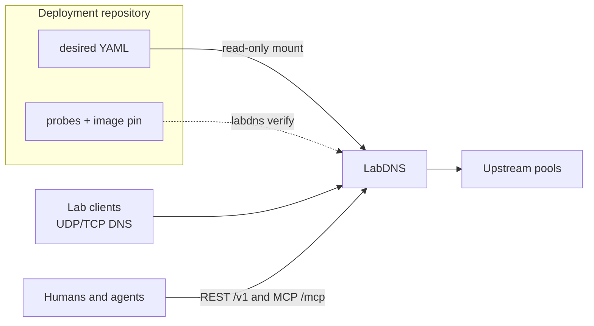

# LabDNS

**Laboratory DNS** with exact overrides, RFC-style wildcards, suffix forwarding, and bounded chaos.

Desired state is a versioned YAML file. Runtime mutations are ephemeral, revision-checked, and equally available over REST and MCP. Restart or reset returns the process to the mounted bootstrap.

[](https://github.com/hilather/go-lab-dns/actions/workflows/ci.yml)
[](https://go.dev/dl/)
[](https://github.com/hilather/go-lab-dns/releases)
[](LICENSE)

Status: **1.0.0-rc.1** candidate · Module [`github.com/hilather/go-lab-dns`](https://github.com/hilather/go-lab-dns) · Image `ghcr.io/hilather/labdns`

New here? Start with [START-HERE.md](START-HERE.md). Architecture, task lists, and ADRs are indexed in [Documentation](#documentation).

---

## Why LabDNS

Labs need a DNS they can **override**, **break on purpose**, and **reset**. LabDNS is that service:

| You need | LabDNS does |
|---|---|
| Pin a name for a fixture or appliance | Exact A/AAAA/CNAME/… records in an authoritative or overlay zone |
| Catch every `*.tools.lab` | RFC 4592 closest-encloser wildcards |
| Keep the rest of the world resolving | Suffix-specific forwarding to UDP/TCP upstream pools |
| Reproduce a flaky resolver | Bounded chaos: delay, drop, truncate, RCODE, TTL, alternate answers |
| Let agents change state safely | One capability registry behind REST `/v1` and MCP `/mcp` |
| GitOps the lab | Read-only YAML bootstrap, drift export, reset-to-file |

It is **not** a public authoritative host, a root-hints recursive resolver, or an HTTP reverse proxy. Wildcard A records can send many names to one box; Host/SNI routing still belongs to ingress.

---

## Quick start

### 1. Build

```bash
git clone https://github.com/hilather/go-lab-dns.git
cd go-lab-dns
go version   # go1.26.x
go build -o labdns ./cmd/labdns
```

Or run the hardened image (non-root UID 65532, read-only root, no capabilities):

```bash
docker build -t ghcr.io/hilather/labdns:local .
```

### 2. Write bootstrap YAML

LabDNS loads **one** `labdns.dev/v1alpha1` document. Unknown fields fail closed. IDs are user-supplied. Durations use Go syntax (`30s`, `5m`, `1h`) — bare numbers are rejected.

```yaml
apiVersion: labdns.dev/v1alpha1
kind: LabDNS
metadata:
  name: my-lab
spec:
  listeners:
    dns:
      address: ":5353"
      protocols: [udp, tcp]
    management:
      address: ":8080"
      restPath: /v1
      mcpPath: /mcp
  defaults:
    ttl: 30s
    negativeTTL: 10s
  zones:
    - id: lab-zone
      name: lab.example.net.
      mode: authoritative
      soa:
        primary: ns1.lab.example.net.
        administrator: hostmaster.lab.example.net.
        serial: auto
        refresh: 1h
        retry: 5m
        expire: 24h
      nameservers: [ns1.lab.example.net.]
      records:
        - id: ns1-a
          owner: ns1
          type: A
          values: [10.42.0.53]
        - id: tools-wildcard-a
          owner: "*.tools"
          type: A
          values: [10.42.0.20]
  access:
    clientGroups: []
```

Copy [testdata/container/config.yaml](testdata/container/config.yaml) for this minimal local-only file, or [testdata/config/valid/pack-sample.yaml](testdata/config/valid/pack-sample.yaml) for forwarding, client groups, and a chaos policy.

Schema: [api/jsonschema/labdns.dev.v1alpha1.json](api/jsonschema/labdns.dev.v1alpha1.json). Full field rules: [docs/04-state-and-configuration.md](docs/04-state-and-configuration.md).

### 3. Validate, canonicalize, serve

```bash
./labdns validate --config lab.yaml
# ok revision=sha256:…

./labdns canonicalize --config lab.yaml --format yaml   # materialized defaults
./labdns serve --config lab.yaml
```

`serve` compiles an immutable snapshot and binds DNS (`:5353` UDP+TCP) plus management HTTP (`:8080`). Invalid bootstrap does **not** listen.

```bash
./labdns query --name ns1.lab.example.net --type A --server 127.0.0.1:5353
# rcode=NOERROR aa=true ra=false
# ns1.lab.example.net. 30s A 10.42.0.53

./labdns healthcheck --url http://127.0.0.1:8080/v1/health/ready
```

Useful flags: `--dns-listen`, `--management-listen ADDR|off`, `--chaos-disable`, `--shutdown-timeout`, `--pid-file`. `LABDNS_CHAOS_DISABLE=1` is a startup lock that YAML, reset, and emergency-enable cannot relax.

### 4. Compose

```bash
docker compose -f examples/compose.smoke.yaml up --build
```

Host `:53` maps to container `:5353`. Management is bound to `127.0.0.1:8080` only. Production GitOps (digest pin, Kubernetes, policy allowlists, probes): [examples/labdns-deploy](examples/labdns-deploy/README.md).

---

## State loading APIs

Bootstrap YAML is **read-only**. The process never writes it. Runtime changes live in memory until export or reset.

```text
read file
  -> reject unknown fields
  -> decode labdns.dev/v1alpha1
  -> normalize names, durations, defaults, IDs
  -> validate cross-references and policy
  -> compile immutable snapshot
  -> compute bootstrap + runtime revisions
  -> bind listeners
```

### CLI

| Command | What it loads |
|---|---|
| `labdns validate --config PATH` | Decode, normalize, validate. Prints `sha256:` revision. |
| `labdns canonicalize --config PATH [--format yaml\|json]` | Same, then emit canonical export (defaults materialized). |
| `labdns serve --config PATH` | Compile, `Store.InstallBootstrap`, bind DNS + management. |
| `labdns verify --config PATH --probes PATH` | Compile and run probe fixtures (optional `--policies`, `--image`, `--server`). |
| `labdns query --name NAME` | Live DNS query (not a state mutation). |

### REST (`/v1`)

Loopback may omit a bearer token (`dev-loopback-unauth`). Remote peers need `Authorization: Bearer`. OpenAPI: [api/openapi/v1.json](api/openapi/v1.json).

**Inspect**

```bash
curl -sS http://127.0.0.1:8080/v1/health/ready
curl -sS http://127.0.0.1:8080/v1/status          # revisions, drift, listeners
curl -sS http://127.0.0.1:8080/v1/state           # canonical + runtimeRevision
curl -sS http://127.0.0.1:8080/v1/schema/config   # published JSON Schema
curl -sS http://127.0.0.1:8080/v1/state:export?format=yaml
```

`GET /v1/state` returns `bootstrapRevision`, `runtimeRevision`, `generation`, `drifted`, and `canonical`. Export YAML is the file you commit back to Git.

**Validate a candidate without applying**

Either a full document (`state`, same shape as `canonical`) or a typed operation list:

```bash
curl -sS -X POST http://127.0.0.1:8080/v1/state:validate \
  -H 'Content-Type: application/json' \
  -d '{
    "operations": [
      {
        "op": "add",
        "target": {"kind": "record", "id": "www-a", "zoneId": "lab-zone"},
        "value": {"id": "www-a", "owner": "www", "type": "A", "values": ["10.42.0.80"]}
      }
    ]
  }'
```

**Plan, apply, reset**

Writes require `expectedRevision` (body, `If-Match`, or `X-LabDNS-Expected-Revision`). Optional `Idempotency-Key` / `idempotencyKey` is retained in a 256-entry LRU.

```bash
REV=$(curl -sS http://127.0.0.1:8080/v1/state | jq -r .runtimeRevision)

curl -sS -X POST http://127.0.0.1:8080/v1/changes:plan \
  -H 'Content-Type: application/json' \
  -d "{\"expectedRevision\":\"$REV\",\"reason\":\"add www\",\"operations\":[{
        \"op\":\"add\",
        \"target\":{\"kind\":\"record\",\"id\":\"www-a\",\"zoneId\":\"lab-zone\"},
        \"value\":{\"id\":\"www-a\",\"owner\":\"www\",\"type\":\"A\",\"values\":[\"10.42.0.80\"]}
      }]}"

curl -sS -X POST http://127.0.0.1:8080/v1/changes:apply \
  -H 'Content-Type: application/json' \
  -H 'Idempotency-Key: add-www-v1' \
  -d "{\"expectedRevision\":\"$REV\",\"reason\":\"add www\",\"operations\":[{
        \"op\":\"add\",
        \"target\":{\"kind\":\"record\",\"id\":\"www-a\",\"zoneId\":\"lab-zone\"},
        \"value\":{\"id\":\"www-a\",\"owner\":\"www\",\"type\":\"A\",\"values\":[\"10.42.0.80\"]}
      }]}"

curl -sS -X POST http://127.0.0.1:8080/v1/state:reset \
  -H 'Content-Type: application/json' \
  -d '{"reason":"discard runtime drift"}'
```

Reset rereads the mounted bootstrap, compiles it, and swaps only on success. A bad file leaves the live snapshot untouched.

Operations are `add` / `update` / `remove` against `zone`, `record`, `forwardingPolicy`, `upstreamPool`, `upstream`, `clientGroup`, `chaosPolicy`, `chaosSafety`, `cache`, `defaults`, `listeners`, `access`, `observability`, `management`, or `chaosActivation`. There is no JSON Patch profile.

### MCP (`/mcp`)

Same application layer as REST. Protocol **2026-07-28** only (`Mcp-Protocol-Version` required). Manifest: [api/mcp/v1.json](api/mcp/v1.json).

| Tool | REST twin |
|---|---|
| `dns_state_get` | `GET /v1/state` |
| `dns_state_validate` | `POST /v1/state:validate` |
| `dns_change_plan` | `POST /v1/changes:plan` |
| `dns_change_apply` | `POST /v1/changes:apply` |
| `dns_state_export` | `GET /v1/state:export` |
| `dns_state_reset` | `POST /v1/state:reset` |
| `dns_schema_get` | `GET /v1/schema/config` |

Resources: `labdns://state`, `labdns://schema/config`, `labdns://status`. Prompts (`plan_dns_override`, `diagnose_resolution`, `design_chaos_experiment`, `convert_runtime_drift`) only call existing tools.

Normative API docs: [docs/06-rest-api.md](docs/06-rest-api.md), [docs/07-mcp-api.md](docs/07-mcp-api.md).

---

## How it fits together



Queries see one immutable compiled snapshot. Mutations copy canonical state, apply typed operations, normalize, validate, compile, then atomically swap. Chaos cannot touch management, liveness, or readiness.

```text
receive packet
  -> admit and parse
  -> load one snapshot
  -> classify client
  -> pre-resolution chaos
  -> local / wildcard / overlay / forward+cache
  -> response chaos
  -> write or deliberately suppress
```

---

## Capabilities

- **DNS** — UDP and TCP, single IN QUERY, EDNS0. Authoritative zones and overlay fallthrough. Exact owners beat wildcards. Bounded CNAME (default depth 8).
- **Records** — A, AAAA, CNAME, TXT, MX, SRV, PTR, CAA, NS, SOA, SVCB, HTTPS, plus validated generic RDATA.
- **Forwarding** — longest-suffix policies, pools (`ordered`, `round-robin`, `random`, `health-aware`), UDP with optional TCP retry. Not an open recursive resolver: unmatched clients get local answers with `RA=0`.
- **Cache** — positive and negative, revision-namespaced, TTL clamps.
- **Chaos** — delay, jitter, RCODE, NODATA, EDE, TTL mutation, alternate/omit/shuffle answers, UDP drop/TC, TCP close/reset/hold, cache and upstream faults. Safety caps, protected names, exempt client groups, automatic expiry, `SIGUSR1` / `labdns chaos emergency-disable`.
- **Control** — REST + MCP parity from one registry. Optimistic concurrency, idempotency, audit ring, RBAC.
- **Ops** — non-root scratch image, GitOps example, structured logs, versioned metrics catalog.

Known limits: [docs/known-limitations.md](docs/known-limitations.md).

---

## Documentation

Full catalog: [docs/README.md](docs/README.md).

### Start here

| Document | Role |
|---|---|
| [START-HERE.md](START-HERE.md) | Operator and contributor onboarding |
| [AGENTS.md](AGENTS.md) | Mandatory rules for humans and AI agents |
| [CONTRIBUTING.md](CONTRIBUTING.md) | Workflow, PR checklist, toolchain |
| [SECURITY.md](SECURITY.md) | Vulnerability reporting |
| [CHANGELOG.md](CHANGELOG.md) | Curated history |
| [MANIFEST.md](MANIFEST.md) | Pack inventory |

### Architecture

| Document | Topic |
|---|---|
| [docs/01-architecture.md](docs/01-architecture.md) | System model, snapshots, query and mutation flows |
| [docs/02-dns-semantics.md](docs/02-dns-semantics.md) | Wire, wildcards, CNAME, flags, RCODE |
| [docs/03-chaos-engine.md](docs/03-chaos-engine.md) | Policies, selectors, effects, safety |
| [docs/04-state-and-configuration.md](docs/04-state-and-configuration.md) | YAML schema, revisions, plan/apply/export/reset |
| [docs/05-control-plane-and-parity.md](docs/05-control-plane-and-parity.md) | Shared capability registry |
| [docs/implementation-design.md](docs/implementation-design.md) | Implementation design (ingested) |

### Interfaces

| Document | Topic |
|---|---|
| [docs/06-rest-api.md](docs/06-rest-api.md) | REST `/v1` |
| [docs/07-mcp-api.md](docs/07-mcp-api.md) | MCP tools, resources, protocol pin |
| [docs/17-error-model.md](docs/17-error-model.md) | Domain errors / problem+json |
| [docs/09-observability.md](docs/09-observability.md) | Metrics, logs, health, tracing |

### Security, ops, release

| Document | Topic |
|---|---|
| [docs/08-security-architecture.md](docs/08-security-architecture.md) | Auth, RBAC, trust boundaries |
| [docs/20-threat-model.md](docs/20-threat-model.md) | Threat model |
| [docs/11-deployment.md](docs/11-deployment.md) | Container and process contract |
| [docs/12-deployment-repository.md](docs/12-deployment-repository.md) | GitOps layout |
| [docs/13-operations-and-runbooks.md](docs/13-operations-and-runbooks.md) | Runbooks |
| [docs/14-release-engineering.md](docs/14-release-engineering.md) | Tags, notes, surface diffs |
| [docs/15-documentation-governance.md](docs/15-documentation-governance.md) | Docs policy |
| [docs/16-compatibility-and-versioning.md](docs/16-compatibility-and-versioning.md) | Compatibility |
| [docs/10-testing-strategy.md](docs/10-testing-strategy.md) | Test layers |
| [docs/18-roadmap-and-non-goals.md](docs/18-roadmap-and-non-goals.md) | Roadmap and non-goals |
| [docs/19-acceptance-criteria.md](docs/19-acceptance-criteria.md) | GA acceptance |
| [docs/21-standards-and-references.md](docs/21-standards-and-references.md) | RFCs and references |

### Architecture decisions

- [0001 Use Go](docs/adr/0001-use-go.md)
- [0002 Purpose-built hybrid resolver](docs/adr/0002-purpose-built-hybrid-resolver.md)
- [0003 Ephemeral state and GitOps](docs/adr/0003-ephemeral-state-and-gitops.md)
- [0004 Shared capability registry](docs/adr/0004-shared-capability-registry.md)
- [0005 Bounded chaos engine](docs/adr/0005-bounded-chaos-engine.md)
- [0006 Pin MCP protocol versions](docs/adr/0006-pin-mcp-protocol-versions.md)
- [0007 Defer unsafe wire chaos](docs/adr/0007-defer-unsafe-wire-chaos.md)

### Task lists and program board

Implementation contracts (not a substitute for the design docs):

- [tasks/README.md](tasks/README.md) — how to take a task
- [tasks/00-program-board.md](tasks/00-program-board.md) — ordered work packages and milestones
- [tasks/parallelization-plan.md](tasks/parallelization-plan.md) — safe parallel lanes
- [tasks/reviewer-checklist.md](tasks/reviewer-checklist.md)
- [tasks/agent-task-template.md](tasks/agent-task-template.md)
- [01](tasks/01-repository-foundation.md) · [02](tasks/02-domain-and-configuration.md) · [03](tasks/03-dns-wire-server.md) · [04](tasks/04-local-resolver-and-wildcards.md) · [05](tasks/05-forwarding-and-cache.md) · [06](tasks/06-snapshot-state-and-mutations.md) · [07](tasks/07-chaos-core.md) · [08](tasks/08-chaos-effects.md) · [09](tasks/09-rest-control-plane.md) · [10](tasks/10-mcp-control-plane.md) · [11](tasks/11-auth-security-audit.md) · [12](tasks/12-observability.md) · [13](tasks/13-cli-and-container.md) · [14](tasks/14-deployment-examples.md) · [15](tasks/15-ci-docs-release.md) · [16](tasks/16-performance-interoperability.md) · [17](tasks/17-ga-hardening.md)

### Generated contracts and examples

- [api/capabilities/v1.json](api/capabilities/v1.json) · [api/openapi/v1.json](api/openapi/v1.json) · [api/mcp/v1.json](api/mcp/v1.json)
- [api/metrics/v1alpha1.json](api/metrics/v1alpha1.json) · [api/cli/help.txt](api/cli/help.txt) · [api/errors/v1.json](api/errors/v1.json)
- [api/jsonschema/labdns.dev.v1alpha1.json](api/jsonschema/labdns.dev.v1alpha1.json) · [api/chaos/effects.json](api/chaos/effects.json)
- [examples/labdns-deploy](examples/labdns-deploy/README.md) · [docs/releases/v1.0.0-rc.2.md](docs/releases/v1.0.0-rc.2.md) · [docs/releases/v1.0.0-rc.1.md](docs/releases/v1.0.0-rc.1.md) · [docs/releases/acceptance-evidence.md](docs/releases/acceptance-evidence.md)

---

## Build and test

Toolchain: **Go 1.26** (`go1.26.x`).

```text
make format
make lint
make test
make test-race
make verify-generated
make test-docs
make test-fuzz-smoke
make test-config-compat
make test-parity
make test-integration
make test-container
make security-scan
make test-changelog
```

`make generate` writes `testdata/generated/fixture.txt` plus the public surfaces: [api/capabilities/v1.json](api/capabilities/v1.json), [api/openapi/v1.json](api/openapi/v1.json), [api/mcp/v1.json](api/mcp/v1.json), [api/metrics/v1alpha1.json](api/metrics/v1alpha1.json), [api/cli/help.txt](api/cli/help.txt), and [api/errors/v1.json](api/errors/v1.json). `make verify-generated` fails if any of those are stale.

`make test-integration` runs interop fixtures in [testdata/interop](testdata/interop), soak/flood/admission in `internal/perf`, and the bench harness. Soak defaults to 2s; use `go test ./internal/perf -soak=30m` or `LABDNS_SOAK_DURATION=30m` for a long run.

Required CI jobs (no bypass): `format`, `lint`, `unit`, `race`, `fuzz-smoke`, `generated-file`, `documentation`, `security-scan`, `container-test`, `changelog`, `parity`, `config-compat`. Tag creation is gated by the Release workflow; see [docs/14-release-engineering.md](docs/14-release-engineering.md).

---

## License

Apache-2.0. See [LICENSE](LICENSE).
