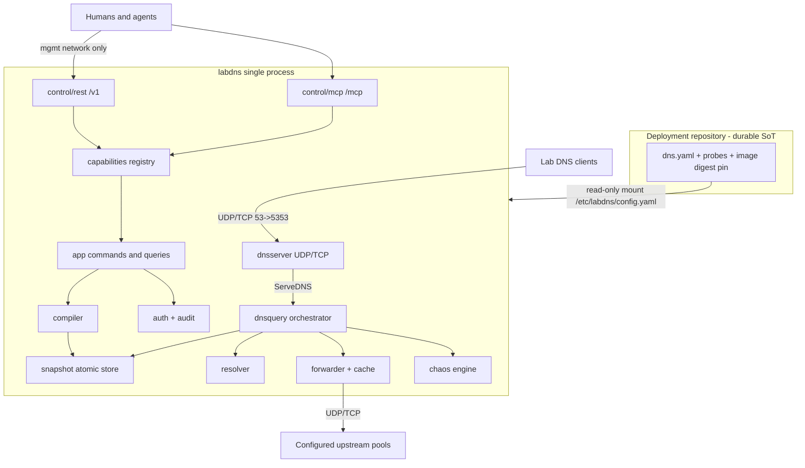
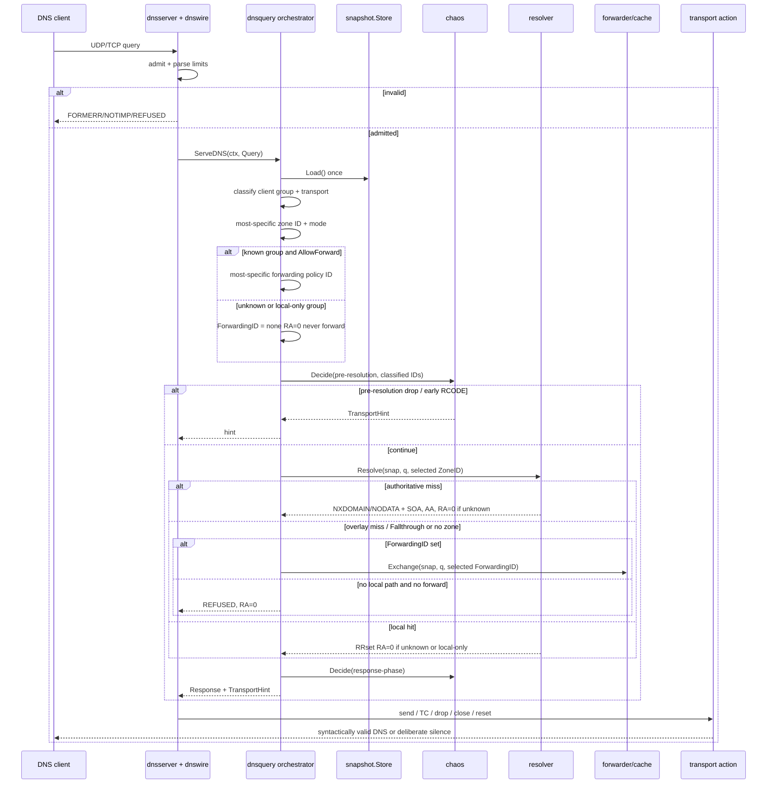
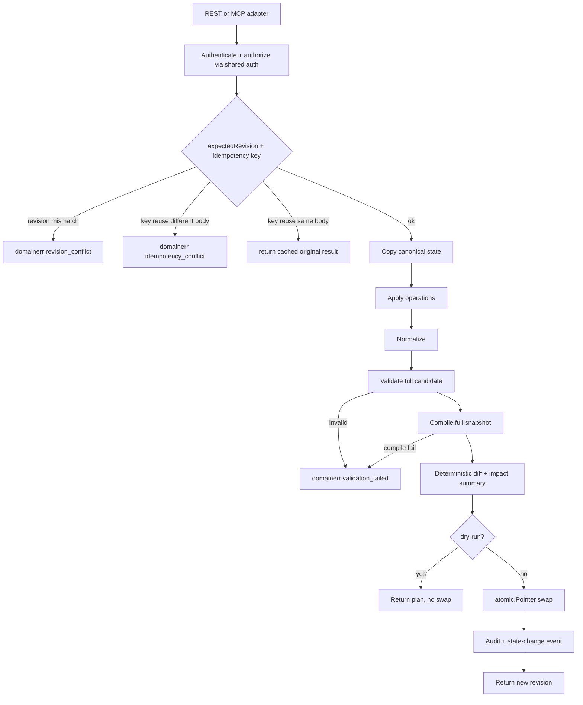
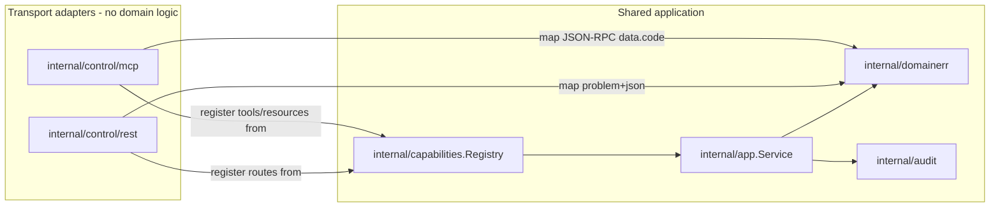
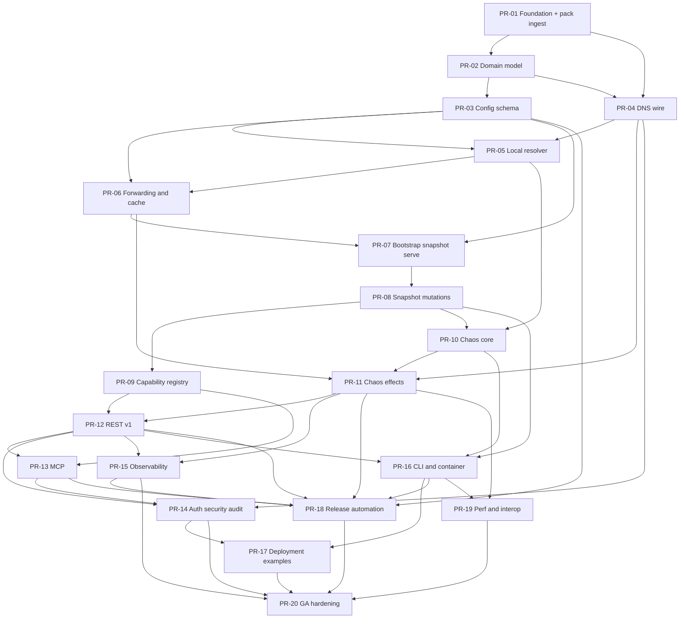

# LabDNS Implementation Design

| Field | Value |
|---|---|
| **Title** | LabDNS Implementation Design |
| **Author** | Implementation owners |
| **Date** | 2026-08-15 |
| **Status** | Approved for implementation |
| **Audience** | Senior engineers implementing LabDNS in `/home/mbrewer/projects/go-lab-dns` |
| **Normative source** | `/home/mbrewer/Downloads/labdns-design-pack` (21 design docs, 7 ADRs, 17 task contracts) |
| **Target repository** | `/home/mbrewer/projects/go-lab-dns` (`origin` = `https://github.com/hilather/go-lab-dns.git`) |

This is an **implementation design**, not a rewrite of the design pack. The pack is the normative source of truth. Where this document restates behavior, it cites pack files.

**How decisions are recorded:**

- **Key Decisions** = pack ADRs, pack-already-decided items, implementation choices this document freezes, and **user decisions of 2026-08-15** (license, module path, Go version, CNAME, auth, image, security reporting, leftover pack OQs).
- First-GA Open Questions are **resolved**. Remaining pack items that were never user-blocking (DoT, Unix socket, snapshot ring, listen addresses, stdio-in-prod) stay as frozen first-GA defaults under Key Decisions / First-GA inclusions.

---

## Overview

LabDNS is a container-first laboratory DNS service: exact overrides, RFC-style wildcard synthesis, authoritative and overlay zones, suffix-specific forwarding, bounded positive/negative cache, and a domain-aware chaos engine. Humans and agents control it equally through REST and MCP. Runtime state is ephemeral and compiled into an immutable snapshot; durable desired state lives in a separate GitOps deployment repository.

The implementation home, `/home/mbrewer/projects/go-lab-dns`, is a **greenfield Git repository**: branch `main`, **no commits**, no files besides `.git`, remote `origin` pointing at `https://github.com/hilather/go-lab-dns.git`. There is no existing module, package, CI, or license to preserve.

This document maps pack invariants onto a concrete Go package tree, freezes the first-implementation (GA) scope against pack milestones M0–M5, names the packages and contracts an engineer must build, and provides a PR plan that an execute-plan agent can follow. Merge order follows `tasks/00-program-board.md`: **FND → CFG → DNS/RES/FWD → STA → CHA-001 → CHA-002 → API → MCP**. Milestone *meanings* are the pack’s, not remapped.

---

## Background & Motivation

### Why this exists

Laboratory devices need a predictable DNS service that can:

- Override exact names and synthesize RFC 4592 wildcards.
- Own a namespace authoritatively, or overlay a few names and forward the rest.
- Forward unresolved names to configured upstream pools (never silently to the host resolver).
- Attach controlled, explainable faults (delay, drop, RCODE, TTL, alternate answers) to a single RRset, including a wildcard source.
- Be driven by agents through MCP with the same semantics as REST.
- Reset to a Git-controlled YAML baseline by restart or explicit reset.

Existing DNS servers are strong at the wire protocol but center static files or plugin chains. They do not provide a revisioned, agent-controlled desired-state model with REST/MCP parity and per-entry chaos. That is the product (ADR 0002).

### Current state of the implementation repository

Verified 2026-08-15:

```text
/home/mbrewer/projects/go-lab-dns
  .git/          only content
  branch:        main
  commits:       none
  worktree:      empty
  origin:        https://github.com/hilather/go-lab-dns.git
```

There is no `go.mod`, no `LICENSE`, no `AGENTS.md`, and no in-tree copy of the design pack. Implementation starts from zero.

### Pain points the pack is designed to prevent

- Two control planes that drift in schema, auth, errors, or audit (ADR 0004).
- Hidden durable state that fights GitOps reset (ADR 0003).
- Unbounded inline sleeps and unexplainable chaos (ADR 0005).
- Malformed-wire generation inside the production DNS process (ADR 0007).
- Tracking an unpinned “latest” MCP revision (ADR 0006).
- Treating documentation, release notes, or CI as optional (root `AGENTS.md`).

### Pack-internal tensions resolved here

These are the only places the 21-doc pack is not a single linear recipe. This document does **not** change pack invariants.

| Tension | Sources | Resolution |
|---|---|---|
| Control-plane vs chaos sequencing | Program board order 7–10 is CHA then API; roadmap Phase 2 then 3 is control plane then chaos; `parallelization-plan.md` merge order lists REST/MCP then chaos | **Follow the program board `Order` / `Depends on` columns.** CHA-001 and CHA-002 merge **before** REST/MCP. Roadmap “Phase 2 then 3” is a *capability narrative*, not a merge graph. Parallelization-plan merge order is superseded by this document for CHA vs API. REST/MCP chaos tests in API-001/MCP-001 **do** assert packet-level effects because CHA-002 is already merged. |
| Milestone labels vs work order | Pack M2 = STA+API+MCP; pack M3 = CHA+SEC+OBS; work order puts CHA before API | **Milestone meanings stay the pack’s.** Because CHA precedes API, a commit that first satisfies M2 already contains CHA-001/002. M2 *exit tests* are still plan/apply/export/reset + parity (not the full chaos packet suite). M3 *exit tests* are chaos packet-level acceptance, emergency disable under load, plus SEC+OBS. |
| Compiler ownership | `01-architecture.md` lists one `internal/compiler`; tasks split compile by domain | **STA owns orchestration** in `internal/compiler`. Exclusive compile files: `internal/resolver/compile.go`, `internal/forwarder/compile.go`, `internal/chaos/compile.go`. Exclusive index *type* files live under `internal/snapshot/` (see snapshot file ownership). `compiler.Compile` calls the domain compilers and returns one `*snapshot.Snapshot`. |
| Snapshot package vs STA exclusive ownership | Indexes live in `snapshot` (import DAG); STA-001 listed `internal/snapshot/**` as exclusive | **`internal/snapshot` is shared.** PR-02 lands type shells + working `Store` (atomic pointer). Exclusive files: `zone_index.go` (PR-05), `forwarding_index.go` (PR-06), `chaos_index.go` (PR-10), `access.go` + bootstrap helpers (PR-07). Growing `Snapshot` fields across sequential PRs is allowed. |
| Capability registry has no task file | Architecture + ADR 0004 | **Dedicated PR after STA mutations** owns `internal/capabilities`. |
| REL-001 vs schemas | `tasks/15` depends on FND but finalizes after schemas | **Two slices**: CI skeleton in foundation; release-diff finalization after OpenAPI/MCP/config/chaos-action/metrics catalogs exist. |
| STA vs M1 | Pack M1 needs “basic snapshot startup,” not full plan/apply; STA-001 is the full mutation core | **Split STA:** PR-07 bootstrap load/serve (M1); PR-08 plan/apply/export/reset (start of M2). PR-08 **hard-depends** on FWD-001. |
| Docs ingest vs foundation stubs | Pack README: copy into the repo *before implementation*; FND-001 verifies root docs exist | **Pack ingest is PR-01**, not a later optional PR. Foundation adds only files the pack does not ship. |

---

## Goals & Non-Goals

### Goals (first implementable GA path = pack M0–M5)

Ship a single static Go binary, `labdns`, that satisfies `docs/19-acceptance-criteria.md`:

1. **Correct DNS data plane** over UDP and TCP: exact records, RFC-style wildcards, authoritative vs overlay, CNAME bounds, NXDOMAIN vs NODATA, suffix forwarding, positive/negative cache.
2. **Bounded chaos** with per-RRset delay, the initial safe effect catalog, deterministic `hash-v1`, global caps, protected objects, simulation, and three independent emergency-disable controls.
3. **One application layer** exposed through REST `/v1` and MCP Streamable HTTP `/mcp`, generated from one capability registry.
4. **Ephemeral immutable snapshots**: bootstrap YAML is read-only; mutations compile a full candidate then atomically swap; reset rereads the mount.
5. **Secure defaults from M1**: not an open **recursive** resolver; unknown clients get local answers with RA=0 and are never forwarded (REFUSED only when there is no local path); no host-resolver fallback; management isolated; non-root, read-only, capability-free container at DEP-001.
6. **Operator and agent explainability**: `resolve:explain`, chaos simulation, drift, export, audit, agent-readable status DTO.
7. **Required CI** as listed in pack `AGENTS.md`, with no bypass path.

### Non-goals (pack-deferred; require a new task plan and usually an ADR)

From `docs/01-architecture.md`, `docs/18-roadmap-and-non-goals.md`, ADR 0007:

- Full Internet recursion from root hints.
- General-purpose public authoritative hosting.
- RFC 2136 dynamic update.
- AXFR, IXFR, secondary-server operation.
- DNSSEC **signing** of local zones.
- Multi-replica runtime-state consensus.
- Web administration UI.
- DHCP integration.
- Client-facing DoH / DoQ.
- Arbitrary malformed DNS packet generation in the main process.
- Kernel-level / general network impairment (`tc`/netem) for non-DNS traffic.
- Direct Git writes from the DNS process.
- An internal database, journal, or hidden volume.

### First-GA inclusions vs explicit follow-ons

| Area | Ships in first GA | Follow-on |
|---|---|---|
| Upstream transport | UDP and TCP | DoT (not in first GA) |
| Delay distributions | `fixed` and `uniform` (pack `03` first-release set) | clipped-normal, log-normal, exponential |
| MCP protocol | **2026-07-28 only** (ADR 0006; user 2026-08-15) | Additional protocol versions |
| MCP stdio | Developer adapter; **not** in the production image | Production-image stdio |
| Snapshot history | Active + bootstrap + **one** previous generation | Larger ring if user overrides |
| Management | HTTP `/v1` + `/mcp`; emergency #3 is **SIGUSR1** | Unix-socket management if user overrides |
| Record types | A, AAAA, CNAME, TXT, MX, SRV, PTR, CAA, NS, SOA, SVCB, HTTPS + validated generic RDATA | Wildcard DNAME rejected; wildcard NS rejected |
| IDs | User-supplied, required, immutable within an API version | Server-generated IDs deferred |
| Canonical export | Materialized defaults, **no comments** (pack `04` recommendation) | Comment sidecar deferred |

---

## Proposed Design

### Product and process shape

One process in one container (`docs/01-architecture.md`):

- DNS listener: UDP + TCP on unprivileged container port `:5353`.
- Management HTTP listener: REST `/v1`, MCP `/mcp`, metrics, liveness, readiness on `:8080`.
- No writable persistent volume. Bootstrap YAML is a read-only mount.
- Optional in-memory audit ring; durable audit is external.
- Host port 53 maps to container 5353. Process runs as a non-root UID with all Linux capabilities dropped.



DNS request handling must not depend on REST or MCP availability. Control-plane failure leaves the active snapshot serving.

`internal/dnsquery` is the **named DNS orchestrator**. `cmd/labdns` constructs `dnsquery.New(...)` and installs it as `dnsserver.Handler`. `dnsserver` does not import resolver, forwarder, or chaos.

### Repository and module layout

Create the pack’s recommended packages on day one so import cycles are visible before features land. Third-party DNS, MCP, telemetry, and schema-library types **must not escape** their adapter packages.

```text
github.com/hilather/go-lab-dns     # Go module path (user 2026-08-15)
  cmd/labdns/                      # process entrypoint, CLI wiring, constructs dnsquery.Handler
  internal/model/                  # canonical domain types only
  internal/app/                    # commands, queries, plans, authz hooks
  internal/config/                 # YAML/JSON decode, normalize, schema validate
  internal/compiler/               # snapshot orchestration only (STA / PR-07+)
  internal/snapshot/               # SHARED package — not exclusive to STA
    snapshot.go                    # Snapshot struct shell (PR-02; fields grow later)
    store.go                       # Store Load/Swap atomic pointer (PR-02)
    zone_index.go                  # EXCLUSIVE: ZoneIndex (RES-001 / PR-05)
    forwarding_index.go            # EXCLUSIVE: ForwardingIndex (FWD-001 / PR-06)
    chaos_index.go                 # EXCLUSIVE: ChaosIndex (CHA-001 / PR-10)
    access.go                      # EXCLUSIVE: AccessIndex + CIDR classify (STA / PR-07)
  internal/resolver/               # exact, wildcard, CNAME, negative answers
    compile.go                     # EXCLUSIVE: fills snapshot.ZoneIndex (RES-001)
  internal/forwarder/              # policy selection, upstream exchange, health
    compile.go                     # EXCLUSIVE: fills snapshot.ForwardingIndex (FWD-001)
  internal/cache/                  # positive and negative cache (not inside Snapshot)
  internal/chaos/                  # selectors, decisions, effects, budgets
    compile.go                     # EXCLUSIVE: fills snapshot.ChaosIndex (CHA-001)
  internal/dnsquery/               # DNS data-plane orchestrator (query path; first used PR-06/07)
  internal/dnswire/                # third-party DNS library adapter
  internal/dnsserver/              # UDP/TCP listeners, admission, timeouts
  internal/control/rest/           # REST transport adapter
  internal/control/mcp/            # MCP transport adapter (official SDK)
  internal/web/                    # embed stub + SPA handler (no app import)
  web/                             # Vite operator console (nested module fence)
  internal/capabilities/           # capability registry and parity metadata
  internal/auth/                   # authentication, scopes, actor identity
  internal/audit/                  # mutation and security events
  internal/observability/          # metrics, tracing, structured logs
  internal/buildinfo/              # version, commit, protocol compatibility
  internal/domainerr/              # stable domain error codes and problem mapping
  internal/testutil/               # fake clock, fake rand, cleanup (FND-001)
  api/                             # source schemas and generated contracts
    openapi/
    jsonschema/
    mcp/
    capabilities/
  testdata/                        # fixtures: config, packets, parity goldens, hash-v1
  docs/                            # pack-ingested normative docs (copied in PR-01)
  tasks/                           # pack-ingested task contracts (copied in PR-01)
  examples/                        # compose, k8s, deployment-repo template
  scripts/                         # generate, verify, release-diff
  Dockerfile
  Makefile
  go.mod
  go.sum
```

`internal/domainerr` and `internal/dnsquery` and `internal/testutil` are justified extensions of `docs/01-architecture.md` (error model, missing orchestrator, FND-001 test helpers).

Allowed import direction (cycle-forbidden):

```text
cmd/labdns
  -> control/rest, control/mcp, dnsserver, dnsquery, app, config, compiler,
     snapshot, observability, buildinfo, chaos (SIGUSR1 / startup disable)

control/rest   -> capabilities, app, domainerr, auth, observability
control/mcp    -> capabilities, app, domainerr, auth, observability
internal/web   -> stdlib only; must not import app, chaos, dnsquery, mcp, or rest

dnsquery       -> snapshot, resolver, forwarder, cache, chaos, model, observability
                  # owns the pack § DNS query flow; implements dnsserver.Handler

app            -> model, compiler, snapshot, resolver, forwarder, cache,
                  chaos, audit, auth, domainerr

compiler       -> model, snapshot, resolver, forwarder, chaos
                  # calls resolver.Compile / forwarder.Compile / chaos.Compile

snapshot       -> model only
                  # compiled index *types* live here so resolver/forwarder/chaos
                  # can import snapshot without a cycle

resolver       -> snapshot, model
forwarder      -> snapshot, model, cache
cache          -> model
chaos          -> snapshot, model
dnsserver      -> dnswire, model
                  # does NOT import snapshot, resolver, forwarder, or chaos
dnswire        -> (third-party DNS lib only)
config         -> model, domainerr
capabilities   -> model, app, domainerr
auth           -> model, domainerr
audit          -> model
observability  -> (otlp/prometheus adapters only)
testutil       -> (stdlib only)
```

`internal/model` imports **nothing** from wire, MCP, HTTP, snapshot, or telemetry packages.

**Why indexes live in `snapshot`:** `Resolve` and `Decide` take `*snapshot.Snapshot`. If `Snapshot` held `resolver.ZoneIndex`, then `snapshot → resolver → snapshot` would cycle. Compile functions in `resolver/compile.go` (etc.) **return and fill `snapshot.ZoneIndex`**.

**Snapshot file ownership (do not treat `internal/snapshot/**` as exclusive to PR-07):**

| File | First PR | Exclusive after shell | Contents |
|---|---|---|---|
| `snapshot.go` | PR-02 | shared (additive fields OK) | `Snapshot` struct; zero-value indexes are valid |
| `store.go` | PR-02 | PR-07 may add bootstrap helpers | `Store` with working `Load`/`Swap`/`Bootstrap`/`Previous` |
| `zone_index.go` | PR-05 | RES-001 | `ZoneIndex` + lookup helpers |
| `forwarding_index.go` | PR-06 | FWD-001 | `ForwardingIndex` + suffix lookup |
| `access.go` | PR-07 | STA-001 slice A | `AccessIndex`, CIDR classify |
| `chaos_index.go` | PR-10 | CHA-001 | `ChaosIndex` |

PR-02 lands **type shells only** so PR-05/PR-06 compile: empty `ZoneIndex` / `ForwardingIndex` / `ChaosIndex` / `AccessIndex` structs and a functional atomic `Store`. Domain PRs fill their exclusive files. `dnsquery` may be introduced in PR-06 against `Store` + classification stubs; AccessIndex fill and bootstrap serve land in PR-07.

### Snapshot model

```go
// internal/snapshot/snapshot.go
package snapshot

// Snapshot is immutable after Compile returns. The cache is NOT a field;
// it is a process-scoped store namespaced by Revision.
type Snapshot struct {
    Canonical          *model.State // normalized source; treat as frozen
    Revision           model.Revision
    BootstrapRevision  model.Revision
    Generation         model.Generation
    CompiledAt         time.Time // wall time at compile

    Listeners          ListenerView
    Access             AccessIndex      // CIDR → client group; unknown = deny
    Defaults           DefaultsView
    Zones              ZoneIndex        // suffix trie, existence tree, RRsets, wildcards, SOA/NS
    Forwarding         ForwardingIndex  // suffix trie, pools, upstreams
    CachePolicy        CachePolicy      // bounds only; not entries
    Chaos              ChaosIndex       // by record/owner/wildcard/zone/fwd/pool/group/global
    Safety             SafetyPolicy     // caps, protected names/groups, allowed CIDRs
    Management         ManagementView
    Observability      ObservabilityView
    EmergencyChaosOff  bool             // execution inhibited regardless of YAML
}

// ZoneIndex, ForwardingIndex, ChaosIndex, AccessIndex are immutable
// (built once in compile.go of the owning domain). They may use internally
// concurrency-safe structures (e.g. atomically swapped health bits live
// in forwarder runtime, not in the snapshot).
```

```go
// internal/snapshot/store.go
type Store struct {
    active    atomic.Pointer[Snapshot]
    previous  atomic.Pointer[Snapshot] // at most one generation
    bootstrap atomic.Pointer[Snapshot]
}

func (s *Store) Load() *Snapshot               // DNS path: one load per query
func (s *Store) Swap(next *Snapshot) *Snapshot // returns previous active
func (s *Store) Bootstrap() *Snapshot
func (s *Store) Previous() *Snapshot
```

No mutation edits the live object graph in place.

### DNS query path

Normative order is `docs/01-architecture.md` § DNS query flow and `docs/02-dns-semantics.md`. Transport does not embed resolver policy. **Classification happens before pre-resolution chaos.**



`resolver.Resolve` **consumes the already-selected zone ID**. It does not rediscover the zone. It still walks that zone’s existence tree, exact/wildcard/CNAME/negative logic.

`forwarder.Exchange` **consumes the already-selected forwarding policy ID**. Longest-suffix selection is done once in `dnsquery` so chaos scopes see the same IDs.

#### Flag assignment (pack `02` § DNS flags)

| Flag | Rule | Owner |
|---|---|---|
| QR | Set on every response | `dnsserver` |
| ID / question | Echo request | `dnsserver` |
| AA | Set only for authoritative **local** answers and authoritative negative answers. Overlay hits are **not** AA. Forwarded answers are **not** AA. | `resolver` (local) / `forwarder` (cleared) |
| RA | Set **only** when forwarding is available **to this client group** (group exists, `AllowForward`, and a forwarding policy is selected). Unknown clients and local-only groups: RA=0. | `dnsquery` |
| RD | Copied from request as a signal. RD=1 does **not** grant forwarding to unknown or local-only clients. Those clients still receive a local answer when one exists. | `dnsquery` |
| AD | **Never** set on local or synthesized data. Never forged on forwarded answers in first GA (no validation). | `resolver` / `forwarder` |
| CD | **Cleared** on local answers. **Passed through** on forwarded queries/responses. | `resolver` (clear) / `forwarder` (pass) |
| TC | Set only on real truncation or an explicit safe chaos truncate action | `dnsserver` / chaos transport |

**Test matrix (RES-001 + FWD-001 + dnsquery):** zone mode ∈ {authoritative, overlay, none} × RD ∈ {0,1} × client group ∈ {known-forward, known-local-only, unknown} × CD ∈ {0,1}. Assert AA/RA/AD/CD/RCODE.

#### Resolver responsibilities (`internal/resolver`)

1. Use the **pre-selected** zone ID (or none).
2. Exact owner RRset.
3. Bounded CNAME chain. Overlay CNAME that would leave the zone **may terminate in a forwarded name**, subject to the global CNAME depth cap (user 2026-08-15).
4. If owner does not exist: closest-encloser wildcard synthesis.
5. Authoritative miss → NXDOMAIN or NODATA with SOA; **never** forward.
6. Overlay miss → `Fallthrough=true`.
7. Apply AA/AD/CD local rules above.

#### Wildcard rules (`docs/02-dns-semantics.md`)

- Leftmost label exactly `*`. Not a glob or regex.
- Exact existing names win, including empty non-terminals.
- Synthesized answer owner is the original QNAME; explanation reports the wildcard source.
- Literal query for an asterisk label is a literal name match.
- Reject wildcard DNAME. Reject wildcard NS in the initial release.
- Wildcard CNAME allowed with the same loop/coexistence rules as exact CNAME.

#### Forwarding (`internal/forwarder`)

- Longest suffix wins; default policy is suffix `.` — selected in `dnsquery` before chaos.
- Strategies: `ordered`, `round-robin`, `random`, `health-aware`.
- UDP truncation from upstream → TCP retry when policy permits.
- NXDOMAIN does **not** normally fail over.
- Timeouts, transport errors, SERVFAIL, REFUSED failover are explicit policy fields.
- Detect self-forwarding and obvious cycles at validation time (PR-03).
- **Never** use host `/etc/resolv.conf` (no config key in v1alpha1).
- **Unknown or unmatched client → never forward** (RA=0). Local authoritative/overlay answers are still served. RCODE=REFUSED **only** when there is no local path (no matching zone, or overlay fallthrough with `ForwardingID == none`).

#### Cache (`internal/cache`)

- Process-scoped, **not** inside `Snapshot`.
- Keys include every request attribute that materially affects the answer, plus `Revision` for local answers.
- Positive and negative TTLs clamped to configured bounds.
- Chaos cache effects change the request path or return a **copy**.

#### Default-deny (invariant 9 — lands in CFG + FWD, not SEC)

Pack invariant 9 is “not an open **recursive** resolver.” Pack `02`/`08` restrict **forwarding** by client network and still serve local answers after classification. **One rule, used everywhere:**

A query whose source IP matches **no** `clientGroups[].cidrs`:

1. is classified `ClientGroupID = ""`;
2. receives **local** authoritative or overlay answers (including authoritative NXDOMAIN/NODATA) with **RA=0**;
3. is **never forwarded** and does not fill cache from upstream;
4. receives **REFUSED** (RA=0) **only when there is no local path** — no matching zone, or overlay fallthrough with no permitted forwarding policy;
5. does not match client-group-scoped chaos policies. Record/zone/global chaos on a *local* answer may still apply. Forwarding-scoped chaos does not apply.
6. is counted as `denied_forward` when a forward would have been required (not when a local answer is served).

`spec.access.unknownClient` is `refuse-forward` and is the only v1alpha1 value (the name means refuse *recursion*, not refuse *all DNS*). `ClientGroup.AllowForward` (default true when a group exists) is the same gate for a *known* group.

**Do not** refuse `ns1.lab.example.net` from `127.0.0.1` against the pack `04` sample unless that YAML lists a matching group that forbids local answers — it does not. M1 `dig` from localhost against that sample must get the local A/CNAME. M1 **must** test: unknown client + local name → NOERROR/NXDOMAIN as appropriate, RA=0; unknown client + name that would only be forwarded → REFUSED, RA=0; no packet to any upstream.

Empty `clientGroups` still serves configured local zones to everyone and forwards to no one. SEC-001 later adds RBAC, rate limits, and the role matrix — not this data-plane rule.

### Snapshot apply path

Normative flow: `docs/01-architecture.md` § Control-plane mutation flow and `docs/04-state-and-configuration.md`.



Reset rereads the mounted bootstrap file, validates and compiles, and swaps only after success. A bad replacement file leaves the current runtime active. Reset clears the in-memory idempotency cache.

The service **never writes** the bootstrap file.

### REST / MCP parity

ADR 0004: one capability registry. Adapters contain no business logic.



```go
// internal/capabilities/capability.go
type Capability struct {
    Name           string
    Version        string
    Description    string
    InputSchema    SchemaRef
    OutputSchema   SchemaRef
    RequiredScopes []string
    Mutating       bool
    Idempotent     bool
    Handler        app.Handler
    REST           *RESTBinding
    MCP            *MCPBinding
}
```

Parity rules CI must enforce:

- Every public REST write has one or more MCP tools with equivalent semantics.
- Every MCP mutation tool has a REST operation.
- REST GET maps to an MCP resource **and** a read tool (first GA ships both).
- Domain error codes and error data match across transports.
- Defaults are applied in `internal/app`, never in an adapter.
- Audit records identify the original transport and otherwise use the same event schema.

**MCP prompts** are not capabilities. PR-13 registers the four pack examples (`docs/07-mcp-api.md`) as read-only prompt templates that only point at existing tools:

1. Plan a DNS override
2. Diagnose why a name resolved a certain way
3. Design a bounded chaos experiment
4. Convert runtime drift into a deployment-repository change

### Chaos engine

ADR 0005 + `docs/03-chaos-engine.md`. Chaos is disabled by default. It must never affect REST, MCP, metrics, liveness, readiness, or the emergency-disable path.

Policy evaluation order (specificity, not automatic cancellation):

1. Exact record ID
2. Synthesized wildcard source record ID
3. Exact owner
4. Zone
5. Forwarding rule
6. Upstream pool
7. Client group
8. Global

Composition: `compose` | `terminal` | `exclusive-group`. Exclusive-group winners are per query and span the pre-resolution and response `Decide` calls. Conflicting terminal transport actions are rejected at compile time.

Action phases (fixed; invalid combinations fail compile):

1. Admission annotations and selector decision
2. Pre-resolution delay or forced early failure
3. Base local/cache/upstream resolution
4. Response replacement, omission, ordering, TTL, EDE
5. Post-resolution delay
6. Transport action: send, truncate, drop, close, reset

`Decide` is called with **already classified** `ClientGroupID`, `ZoneID`, `ForwardingPolicyID`, transport, and QNAME/QTYPE. The engine must not re-implement zone or forwarding selection.

#### `hash-v1` algorithm (compatibility surface — frozen here)

Changing any of the following is a **new algorithm ID**, not a silent `hash-v1` tweak (`docs/16-compatibility-and-versioning.md`). PR-10 goldens must match bit-for-bit on amd64 and arm64.

**Hash:** SHA-256.

**Encoding:** concatenate, in this exact order:

1. ASCII magic `labdns-hash-v1\n` (15 bytes, no length prefix).
2. Ten length-prefixed fields. Each field is `uint32` big-endian length + exactly that many bytes (no NUL terminator). Empty field = `0x00000000`.

| # | Field | Bytes |
|---|---|---|
| 1 | algorithm id | `hash-v1` |
| 2 | policy seed | UTF-8 seed string as configured |
| 3 | revision | UTF-8 `model.Revision` including the `sha256:` prefix. If the policy carries an explicit `selector.revision`, use that; else the snapshot `Revision` |
| 4 | policy ID | UTF-8 policy id |
| 5 | QNAME | UTF-8 canonical FQDN (lower-case, trailing dot). **Presentation form, not DNS wire compression** |
| 6 | QTYPE | UTF-8 RFC 1035 mnemonic in uppercase (`A`, `AAAA`, `CNAME`, …) or `TYPE<n>` for types without a mnemonic |
| 7 | client-group | UTF-8 group id, or the privacy-safe bucket string when the policy requests a bucket instead of a group id. Unknown/empty is the empty field |
| 8 | transport | exactly `udp` or `tcp` |
| 9 | time bucket | If `selector.timeBucket` is unset/zero, empty. Else `floor(wall_UTC / bucket) * bucket` formatted as RFC3339 with `Z` (`2006-01-02T15:04:05Z`). Truncation is toward −∞ on the Unix timeline. **`timeBucket` must be ≥ 1s** (CFG validation); sub-second buckets are rejected so this second-precision encoding cannot collapse windows. |
| 10 | simulation nonce | UTF-8 nonce, or empty when not simulating |

**Digest use:**

- Let `d = SHA-256(encoding)`.
- `u0 = uint64(d[0:8])` big-endian.
- `u1 = uint64(d[8:16])` big-endian.
- Uniform `[0,1)` values: `p = float64(u0) / 2^64`, `w = float64(u1) / 2^64`. (Never `u/2^64` in integer math.)
- **Probability gate:** trigger iff `p < probability` (probability in `[0,1]`; 1.0 always triggers).
- **Weighted outcome:** ignore outcomes with weight ≤ 0. `total = sum(weights)` as `float64`. `t = w * total`. Walk outcomes in **configured order**; select the first whose cumulative weight is `> t`. If `total == 0`, skip the policy (no outcome).
- **Uniform delay** in `[min,max]`: use `u1` of a **second** `hash-v1` encoding that is identical except field 10 is the UTF-8 string `delay` concatenated with the original nonce (so delay is independent of outcome pick when a nonce is absent). Map `float64(u1)/2^64` into `[min,max)` as `min + unit*(max-min)`.

**Not inputs:** raw client IP, goroutine id, query id, wall time except the documented bucket.

**CFG rule (PR-03) and goldens (PR-10):** reject `selector.timeBucket` < 1s with `validation_failed`. Required golden: `timeBucket: 1s` at two instants in the same UTC second (same field 9) and at the next second (different field 9). Sub-second buckets are a new algorithm ID or a later schema field, not `hash-v1`.

#### Emergency disable — three independent controls

Unix-socket management is **out of first GA**. The third control is a **signal**, as the pack allows (“local signal or Unix-socket”).

| # | Control | Lands in | Notes |
|---|---|---|---|
| 1 | Startup `--chaos-disable` / `LABDNS_CHAOS_DISABLE=1` | PR-10 + PR-16 | YAML and ordinary API cannot relax it |
| 2 | Authenticated `dns_chaos_emergency_disable` | PR-12 (REST) / PR-13 (MCP) | Shared capability |
| 3 | **`SIGUSR1`** | PR-10 handler + PR-16 wiring | Same effect as #2: set `EmergencyChaosOff`, swap snapshot, cancel delays. Works when the management listener is down. Privilege = ability to signal the process UID. Optional CLI `labdns chaos emergency-disable --pid-file` sends SIGUSR1 and does not call HTTP |

`SIGUSR2` is reserved and ignored in first GA. Tests: disable under load; disable with management port unbound.

Simulation never sleeps, sends packets, writes cache, consumes budgets, or activates policies.

#### First-GA effect catalog (CHA-002)

| Family | Effects | Stacked commit / optional sub-PR |
|---|---|---|
| Delay | context-aware `fixed` and `uniform`; phases before-resolution, before-upstream, after-upstream, before-response | 11.1 |
| Response | SERVFAIL, REFUSED, NXDOMAIN, NODATA, FORMERR, NOTIMP (last two require medium/high safety class) + optional EDE; TTL set/clamp/zero/jitter; alternate/omit/limit/shuffle/rotate; flap | 11.2 |
| Transport | UDP silent drop; UDP forced TC; bounded TCP no-response then close; TCP close; TCP reset | 11.3 |
| Cache / upstream / pressure | bypass, force-miss, expire-this-request, stale copy; upstream delay/unavailable/force/timeout/failover/synthetic RCODE; policy-scoped QPS | 11.4 + integrator conflict tests |

### Capability list (REST ↔ MCP)

Strict union of `docs/05` + `docs/06` + `docs/07` plus the pack-03 runtime ops that are not otherwise covered. First GA implements every row.

| Capability | REST | MCP tool / resource | Scopes |
|---|---|---|---|
| Health live | `GET /v1/health/live` | *not a tool* (process-local) | none |
| Health ready | `GET /v1/health/ready` | *not a tool* | none |
| Version | `GET /v1/version` | `dns_version_get` **and** the same payload is embedded in `dns_capabilities_get` | `dns.read` |
| Capabilities | `GET /v1/capabilities` | `dns_capabilities_get`, `labdns://capabilities` | `dns.read` |
| Agent status | `GET /v1/status` | `dns_status_get`, `labdns://status` | `dns.read` |
| Config schema | `GET /v1/schema/config` | `dns_schema_get`, `labdns://schema/config` | `dns.read` |
| Get state | `GET /v1/state` | `dns_state_get`, `labdns://state` | `dns.read` |
| Validate | `POST /v1/state:validate` | `dns_state_validate` | `dns.write` |
| Plan | `POST /v1/changes:plan` | `dns_change_plan` | `dns.write` |
| Apply | `POST /v1/changes:apply` | `dns_change_apply` | `dns.write` + resource scopes |
| Export | `GET /v1/state:export` | `dns_state_export` | `dns.read` |
| Reset | `POST /v1/state:reset` | `dns_state_reset` | `dns.admin` |
| Zones list/get | `GET /v1/zones`, `GET /v1/zones/{zoneId}` | `dns_zones_list`, `dns_zone_get`, `labdns://zones/{zoneId}` | `dns.read` |
| Records list/get | `GET /v1/zones/{zoneId}/records`, `GET /v1/zones/{zoneId}/records/{recordId}` | `dns_records_list`, `dns_record_get`, `labdns://records/{recordId}` | `dns.read` |
| Resolve | `POST /v1/resolve` | `dns_resolve` | `dns.read` |
| Explain | `POST /v1/resolve:explain` | `dns_explain_resolution` | `dns.read` |
| Forwarding | `GET /v1/forwarding/policies` | `dns_forwarding_policies_list` | `dns.forwarders.read` |
| Pools | `GET /v1/upstream-pools` | `dns_upstream_pools_list` | `dns.forwarders.read` |
| Upstream status | `GET /v1/upstreams/status` | `dns_upstreams_status`, `labdns://upstreams` | `dns.forwarders.read` |
| Cache status | `GET /v1/cache/status` | `dns_cache_status` | `dns.read` |
| Cache flush | `POST /v1/cache:flush` | `dns_cache_flush` | `dns.admin` |
| Chaos status | `GET /v1/chaos/status` | `dns_chaos_status` | `dns.chaos.read` |
| Chaos policies | `GET /v1/chaos/policies`, `GET /v1/chaos/policies/{policyId}` | `dns_chaos_policies_list`, `dns_chaos_policy_get`, `labdns://chaos/policies/{policyId}` | `dns.chaos.read` |
| Simulate | `POST /v1/chaos:simulate` | `dns_chaos_simulate` | `dns.chaos.read` |
| Activate / deactivate | `POST /v1/chaos/policies/{id}:activate`, `:deactivate` | `dns_chaos_activate`, `dns_chaos_deactivate` | `dns.chaos.activate` |
| Set expiry | `POST /v1/chaos/policies/{id}:expire` | `dns_chaos_set_expiry` | `dns.chaos.activate` |
| Emergency disable / enable | `POST /v1/chaos:emergency-disable`, `:emergency-enable` | `dns_chaos_emergency_disable`, `dns_chaos_emergency_enable` | `dns.chaos.emergency` |
| Audit list | `GET /v1/audit` | `dns_audit_query`, `labdns://audit/recent` | `dns.audit.read` |
| Audit get | `GET /v1/audit/{eventId}` | `dns_audit_get` | `dns.audit.read` |
| Docs: DNS semantics | `GET /v1/docs/dns-semantics` | `dns_docs_get` (`id=dns-semantics`), `labdns://docs/dns-semantics` | `dns.read` |
| Docs: chaos safety | `GET /v1/docs/chaos-safety` | `dns_docs_get` (`id=chaos-safety`), `labdns://docs/chaos-safety` | `dns.read` |

`GET /v1/status` is the single **agent-readable status DTO** (`docs/09`). OBS-001 fills it; it does not invent a second schema.

```go
// internal/app/status.go — used by GET /v1/status, ready, chaos/upstreams/cache views
type Status struct {
    Version            buildinfo.Info
    Revisions          RevisionView // bootstrap, runtime, generation, drifted, loadedAt
    Listeners          []ListenerStatus
    Cache              CacheSummary
    Upstreams          []UpstreamStatus
    Chaos              ChaosRuntimeStatus // enabled, emergencyDisabled, activePolicies, nearestExpiry
    Warnings           []Warning // bounded, stable codes
}
```

Management resolve **defaults to not consuming live chaos**.

`dns_chaos_set_expiry` is the pack-03 “extend or shorten expiry” runtime op. It is a typed mutation that compiles to the same `op=update` + `target=chaosPolicy` path as `changes:apply` (shared handler). Activate/deactivate are likewise typed wrappers, not a second state machine.

Typed CRUD write routes are **not** added in first GA; plan/apply is the write path.

### Key interfaces

```go
// internal/testutil/clock.go  (FND-001 exclusive)
type Clock interface {
    Now() time.Time                    // wall clock (schedules, expiry, time buckets)
    Monotonic() time.Duration          // durations, delay budgets
    NewTimer(d time.Duration) Timer    // context-aware; fake clock advances
}
type Timer interface {
    C() <-chan time.Time
    Stop() bool
}

// internal/testutil/rand.go
type Rand interface {
    Uint64() uint64
}

// internal/auth/identity.go  (interface in PR-01; implementation in SEC-001)
type Actor struct {
    ID         string
    Class      string   // token | mtls | proxy | local-signal | startup
    Scopes     []string
    Groups     []string
}

// ---------------------------------------------------------------------------
// model
// ---------------------------------------------------------------------------

type Name string
type RecordID string
type ZoneID string
type PolicyID string
type PoolID string
type UpstreamID string
type ClientGroupID string
type Revision string    // "sha256:" + lowercase hex of SHA-256(canonical JSON)
type Generation uint64

const (
    APIVersionV1Alpha1 = "labdns.dev/v1alpha1"
    KindLabDNS         = "LabDNS"
)

type State struct {
    APIVersion string
    Kind       string
    Metadata   Metadata
    Spec       Spec
}

type Metadata struct {
    Name   string
    Labels map[string]string
}

// Spec is frozen in CFG-001 (PR-03) together with JSON Schema.
// Field list below is the v1alpha1 contract, derived from docs/04 sample + 01/03/08/09.
type Spec struct {
    Listeners     ListenersSpec
    Access        AccessSpec
    Defaults      DefaultsSpec
    Zones         []Zone
    Forwarding    ForwardingSpec
    Cache         CacheSpec
    Chaos         ChaosSpec
    Observability ObservabilitySpec
    Management    ManagementSpec
}

type ListenersSpec struct {
    DNS        DNSListenerSpec  // address, protocols []{udp,tcp}
    Management MgmtListenerSpec // address, restPath, mcpPath
}

type AccessSpec struct {
    UnknownClient string        // only "refuse-forward" in v1alpha1
    ClientGroups  []ClientGroup
}

type ClientGroup struct {
    ID          ClientGroupID
    CIDRs       []string
    ChaosExempt bool
    AllowForward bool // default true when group exists; false → local only, RA=0
}

type DefaultsSpec struct {
    TTL         time.Duration
    NegativeTTL time.Duration
    CNAMEDepth  int // safe default 8
}

type Zone struct {
    ID          ZoneID
    Name        Name
    Mode        ZoneMode // authoritative | overlay
    SOA         *SOA
    Nameservers []Name
    Records     []Record
}

type Record struct {
    ID              RecordID
    Owner           string // relative or FQDN; normalized to Name
    Type            RRType
    TTL             time.Duration
    Values          []string
    GenericRDATA    *GenericRDATA // presentation-format escape hatch
    ChaosPolicyRefs []PolicyID
}

type ForwardingSpec struct {
    Policies []ForwardingPolicy
    Pools    []UpstreamPool
}

type ForwardingPolicy struct {
    ID           PolicyID
    Suffix       Name // "." is default
    UpstreamPool PoolID
    Failover     FailoverSpec
}

type UpstreamPool struct {
    ID        PoolID
    Strategy  string // ordered | round-robin | random | health-aware
    Upstreams []Upstream
}

type Upstream struct {
    ID        UpstreamID
    Endpoint  string // host:port
    Transport string // udp | tcp   (dot is not a v1alpha1 value)
}

type CacheSpec struct {
    Enabled             bool
    MaxEntries          int
    MinimumTTL          time.Duration
    MaximumTTL          time.Duration
    MaximumNegativeTTL  time.Duration
    StaleServing        bool
}

type ChaosSpec struct {
    Enabled           bool
    EmergencyDisabled bool
    Safety            SafetySpec
    Policies          []ChaosPolicy
}

// SafetySpec and ChaosPolicy fields follow docs/03 (id, owner, reason, enabled,
// expiresAt, safetyClass, scope, selector, outcomes, composition).

type ObservabilitySpec struct {
    LogQNAME bool // default false; if true, requires debug mode + bound
}

type ManagementSpec struct {
    Auth AuthSpec // profile: dev-loopback-unauth | bearer; secret refs only
}

// ---------------------------------------------------------------------------
// Operations — typed change set (STA-001 / CFG-001 / fuzz target)
// ---------------------------------------------------------------------------

// Operation is a discriminated union. Unknown op or target → validation_failed.
// JSON: {"op":"add|update|remove","target":{...},"value":{...}}
type Operation struct {
    Op     OpKind
    Target Target
    Value  json.RawMessage // decoded against target.Kind; required for add/update
}

type OpKind string

const (
    OpAdd    OpKind = "add"
    OpUpdate OpKind = "update"
    OpRemove OpKind = "remove"
)

type TargetKind string

const (
    TargetZone             TargetKind = "zone"
    TargetRecord           TargetKind = "record"
    TargetForwardingPolicy TargetKind = "forwardingPolicy"
    TargetUpstreamPool     TargetKind = "upstreamPool"
    TargetUpstream         TargetKind = "upstream"
    TargetClientGroup      TargetKind = "clientGroup"
    TargetChaosPolicy      TargetKind = "chaosPolicy"
    TargetChaosSafety      TargetKind = "chaosSafety"   // update only; ordinary roles forbidden
    TargetCache            TargetKind = "cache"         // update only
    TargetDefaults         TargetKind = "defaults"      // update only
    TargetListeners        TargetKind = "listeners"     // update only
    TargetAccess           TargetKind = "access"        // update only
    TargetObservability    TargetKind = "observability" // update only
    TargetManagement       TargetKind = "management"    // update only
    TargetUI               TargetKind = "ui"            // update only
    TargetChaosActivation  TargetKind = "chaosActivation" // update: enabled/expiresAt
)

type Target struct {
    Kind   TargetKind
    ID     string // zone/record/policy/pool/upstream/group id as applicable
    ZoneID ZoneID // required when Kind == record
}

// Replace-entire-object is OpUpdate on TargetAccess / TargetCache / etc.
// There is no JSON Patch / RFC 6902 profile in first GA.
// Activate / deactivate / set-expiry are OpUpdate + TargetChaosActivation
// (value: {"enabled":bool,"expiresAt":"..."}). They share Apply().

// ---------------------------------------------------------------------------
// compiler
// ---------------------------------------------------------------------------

// internal/compiler/compile.go
func Compile(ctx context.Context, st *model.State, opts CompileOpts) (*snapshot.Snapshot, error)

type CompileOpts struct {
    Clock              testutil.Clock
    BootstrapRevision  model.Revision
    Generation         model.Generation
    EmergencyChaosOff  bool
}

// Compile calls, in order:
//   config.Normalize + config.Validate (if not already)
//   resolver.Compile(st)  → snapshot.ZoneIndex
//   forwarder.Compile(st) → snapshot.ForwardingIndex
//   chaos.Compile(st)     → snapshot.ChaosIndex
//   snapshot.CompileAccess(st)
//   hash canonical JSON → Revision

// ---------------------------------------------------------------------------
// resolver / forwarder / chaos
// ---------------------------------------------------------------------------

func Resolve(ctx context.Context, snap *snapshot.Snapshot, q Query, zoneID ZoneID) (Result, error)
func Exchange(ctx context.Context, snap *snapshot.Snapshot, q Query, policyID PolicyID) (Result, error)

type Result struct {
    RCode           RCode
    Answers         []RR
    Authority       []RR
    Additional      []RR
    AA, RA, AD, CD  bool
    Source          Source // exact | wildcard | negative | fallthrough | upstream | cache
    ZoneID          ZoneID
    ZoneMode        ZoneMode
    WildcardSource  *RecordID
    ClosestEncloser *Name
    Fallthrough     bool
    ForwardingID    PolicyID
    UpstreamID      UpstreamID
    Explanation     *Explanation
}

type Query struct {
    Name      Name
    Type      RRType
    Class     RRClass // IN
    Client    netip.Addr
    Transport Transport // udp | tcp
    RD, CD    bool
}

type Engine interface {
    Decide(ctx context.Context, snap *snapshot.Snapshot, in DecisionIn) (ActionPlan, error)
    Simulate(ctx context.Context, snap *snapshot.Snapshot, in SimulateIn) (SimulateOut, error)
}

type DecisionIn struct {
    Query            Query
    ClientGroupID    ClientGroupID
    ZoneID           ZoneID
    ForwardingID     PolicyID
    Base             *Result // nil in pre-resolution phase
    Phase            Phase
    SimulationNonce  string
}

// ---------------------------------------------------------------------------
// dnsquery orchestrator
// ---------------------------------------------------------------------------

// New returns a dnsserver.Handler.
func New(store *snapshot.Store, eng Engine, cache *cache.Cache, log Logger, clk testutil.Clock) dnsserver.Handler

// ---------------------------------------------------------------------------
// dnsserver
// ---------------------------------------------------------------------------

type Handler interface {
    ServeDNS(ctx context.Context, req *Query) (*Response, TransportHint, error)
}

type TransportHint int // Send | Drop | Truncate | TCPClose | TCPReset | HoldThenClose

// ---------------------------------------------------------------------------
// app.Service — full handler surface (one method per capability except health)
// ---------------------------------------------------------------------------

type Service interface {
    Version(ctx context.Context, actor Actor) (*buildinfo.Info, error)
    Capabilities(ctx context.Context, actor Actor) (*CapabilityView, error)
    Status(ctx context.Context, actor Actor) (*Status, error)
    ConfigSchema(ctx context.Context, actor Actor) ([]byte, error)
    Docs(ctx context.Context, actor Actor, id string) ([]byte, error)

    GetState(ctx context.Context, actor Actor) (*StateView, error)
    Validate(ctx context.Context, actor Actor, in ValidateIn) (*Plan, error)
    Plan(ctx context.Context, actor Actor, in ChangeIn) (*Plan, error)
    Apply(ctx context.Context, actor Actor, in ChangeIn) (*ApplyResult, error)
    Export(ctx context.Context, actor Actor, format ExportFormat) (*Export, error)
    Reset(ctx context.Context, actor Actor, in ResetIn) (*ApplyResult, error)

    ListZones(ctx context.Context, actor Actor, page Page) (*ZoneList, error)
    GetZone(ctx context.Context, actor Actor, id ZoneID) (*Zone, error)
    ListRecords(ctx context.Context, actor Actor, zone ZoneID, page Page) (*RecordList, error)
    GetRecord(ctx context.Context, actor Actor, zone ZoneID, id RecordID) (*Record, error)

    Resolve(ctx context.Context, actor Actor, in ResolveIn) (*ResolveOut, error)
    Explain(ctx context.Context, actor Actor, in ResolveIn) (*ExplainOut, error)

    ListForwardingPolicies(ctx context.Context, actor Actor) ([]ForwardingPolicy, error)
    ListUpstreamPools(ctx context.Context, actor Actor) ([]UpstreamPool, error)
    UpstreamsStatus(ctx context.Context, actor Actor) ([]UpstreamStatus, error)
    CacheStatus(ctx context.Context, actor Actor) (*CacheSummary, error)
    CacheFlush(ctx context.Context, actor Actor, in FlushIn) error

    ChaosStatus(ctx context.Context, actor Actor) (*ChaosRuntimeStatus, error)
    ListChaosPolicies(ctx context.Context, actor Actor) ([]ChaosPolicy, error)
    GetChaosPolicy(ctx context.Context, actor Actor, id PolicyID) (*ChaosPolicy, error)
    SimulateChaos(ctx context.Context, actor Actor, in SimulateIn) (*SimulateOut, error)
    ActivateChaos(ctx context.Context, actor Actor, in ActivationIn) (*ApplyResult, error)
    DeactivateChaos(ctx context.Context, actor Actor, in ActivationIn) (*ApplyResult, error)
    SetChaosExpiry(ctx context.Context, actor Actor, in ExpiryIn) (*ApplyResult, error)
    EmergencyDisableChaos(ctx context.Context, actor Actor, in EmergencyIn) (*ApplyResult, error)
    EmergencyEnableChaos(ctx context.Context, actor Actor, in EmergencyIn) (*ApplyResult, error)

    QueryAudit(ctx context.Context, actor Actor, in AuditQuery) (*AuditList, error)
    GetAudit(ctx context.Context, actor Actor, id string) (*AuditEvent, error)
}

type ChangeIn struct {
    ExpectedRevision Revision
    IdempotencyKey   string
    Reason           string
    Ticket           string
    Mode             string // plan | apply
    Operations       []Operation
}
```

Clock and RNG are injected from `internal/testutil` (FND-001). Production duration math uses `Clock.Monotonic`; absolute schedules and `hash-v1` buckets use `Clock.Now` (`docs/03-chaos-engine.md`).

CFG-001 (PR-03) **must** publish the normative field list above as JSON Schema in the same PR that freezes `Spec`. Additional optional fields after that PR require a schema revision.

### Configuration and schema

Single config API version in first GA: `apiVersion: labdns.dev/v1alpha1`, `kind: LabDNS`.

Implementation must:

- Reject unknown fields at every nesting level.
- Require stable user-supplied IDs for zones, records, forwarding policies, upstreams, client groups, and chaos policies.
- Canonicalize names during normalization.
- Materialize defaults in canonical export.
- Hash **canonical normalized JSON**, not raw YAML bytes.
- Keep secrets as references.
- Generate JSON Schema from one source under `api/jsonschema/`.
- Default-deny: `access.unknownClient: refuse-forward` (only v1alpha1 value). Unknown clients get local answers, RA=0, never forward; REFUSED only when there is no local path. Empty `clientGroups` still serves local zones and forwards nothing.

Listener defaults (first GA):

```yaml
spec:
  listeners:
    dns:
      address: ":5353"
      protocols: [udp, tcp]
    management:
      address: ":8080"
      restPath: /v1
      mcpPath: /mcp
  access:
    unknownClient: refuse-forward
    clientGroups: []          # local zones still answer; nothing is forwarded
```

Compiler validation in CFG/STA:

- CNAME cannot coexist with other ordinary data at the same owner.
- Statically detectable CNAME loops rejected.
- Wildcard DNAME / wildcard NS rejected.
- Chaos action-phase conflicts rejected.
- Alternate-answer addresses restricted to configured lab CIDRs.
- High-impact runtime policies require expiry.
- Self-forwarding / cyclic forwarding rejected.
- Cross-references must resolve.

### CLI surface (DEP-001)

```text
labdns serve --config=/etc/labdns/config.yaml [--chaos-disable]
labdns validate --config=...
labdns canonicalize --config=...
labdns verify --config=... --probes=...
labdns query --name=... --type=A
labdns healthcheck --url=http://127.0.0.1:8080/v1/health/ready
labdns chaos emergency-disable --pid-file=/run/labdns.pid
labdns version
```

### Container

Multi-stage minimal image, numeric non-root UID, read-only root filesystem, `cap_drop: ALL`, `no-new-privileges`, tmpfs `/tmp`, no shell unless documented. Image: **`ghcr.io/hilather/labdns`** (pin by digest in GitOps).

Initial release: **one mutable runtime replica**.

### Testing and Make targets

```text
make format
make lint
make generate
make verify-generated
make test
make test-race
make test-fuzz-smoke
make test-integration
make test-parity
make test-config-compat
make test-docs
make test-container
make security-scan
```

Foundation wires these to **real checks or explicit fail-if-unimplemented stubs**. A no-op success is a defect.

Parity test shape for every capability:

1. Invoke the shared domain handler.
2. Invoke REST with equivalent input.
3. Invoke MCP with equivalent input.
4. Normalize transport envelopes.
5. Assert equivalent domain output, error code, authorization result, revision behavior, and audit event.

### Documentation ingestion

Pack `README.md`: the pack is **intended to be copied into a new application repository before implementation begins**. `START-HERE.md`, `AGENTS.md`, and FND-001 (“verifies required root documents exist”) assume in-tree `docs/` and `tasks/`.

**Decision:** PR-01 copies `/home/mbrewer/Downloads/labdns-design-pack` (root guidance + `docs/` + `tasks/`) first, then adds only files the pack does not already ship (`go.mod`, `Makefile`, CI, empty `internal/*`, `internal/testutil`, `internal/dnsquery`, `internal/domainerr`). Subsequent PRs update in-tree docs in the same change. Refusing in-tree docs is a pack-process exception and is not the default path.

---

## API / Interface Changes

There is no existing public API. First GA **introduces**:

| Surface | First-GA identity |
|---|---|
| Application semver | `0.1.0` until GA tag; GA is `1.0.0` after GA-001 |
| Config API | `labdns.dev/v1alpha1` |
| REST | `/v1` + `application/problem+json` (RFC 9457) |
| MCP protocol | `2026-07-28` (ADR 0006) |
| MCP capability manifest | versioned artifact generated from the registry |
| Chaos algorithm | `hash-v1` as specified above |
| Probe format | `labdns.dev/probes/v1alpha1` |
| Error catalog | codes in `docs/17-error-model.md` |
| CLI flags, env vars, ports, paths | deployment compatibility surface |
| Metrics names/labels | operational compatibility surface |
| Status DTO | `GET /v1/status` / `labdns://status` |

Stable domain error codes (do not invent synonyms):

```text
validation_failed
revision_conflict
idempotency_conflict
not_found
method_not_allowed
already_exists
forbidden
unauthenticated
rate_limited
protected_object
chaos_disabled
chaos_budget_exceeded
policy_expired
unsupported_capability
unsupported_protocol_version
upstream_unavailable
resolution_failed
internal_error
```

REST maps these to `application/problem+json`. MCP maps the same object under JSON-RPC `data`. DNS clients receive DNS-standard RCODEs; explanation and audit carry the domain code.

### Mutation contract (both transports)

Input: `expectedRevision`, `idempotencyKey`, `reason`, optional ticket, plan-or-apply mode, `[]Operation` as specified above.

Output: previous and candidate revision, normalized diff, validation warnings/errors, impact summary (names, wildcard coverage, authoritative-miss changes, client groups, forwarding, chaos maximums/expiry, probes, required permissions), authorization metadata safe for the caller, audit event ID when applied, deployment-repository operations.

`expectedRevision` is required for writes except privileged bootstrap reset.

---

## Data Model Changes

Greenfield: no migration from a previous shipped schema. Still implement a **migration interface** in CFG-001 so a future `v1` / `v1beta1` has a place to land.

Canonicalization rules that must be tested:

- Names: FQDN, lower-case ASCII, trailing dot. **Non-ASCII names are rejected** in `v1alpha1` until an IDNA profile is chosen in a later release.
- Durations: Go `time.ParseDuration` syntax; recorded in config docs in PR-03.
- Defaults materialized in export so formatting-only YAML changes do not change revision.
- Duplicate semantic RRsets: reject unless an explicit merge flag is added later.
- Record ordering deterministic unless answer-order or chaos policy changes it.

Revision JSON:

```json
{
  "bootstrapRevision": "sha256:...",
  "runtimeRevision": "sha256:...",
  "generation": 18,
  "drifted": true,
  "loadedAt": "2026-08-15T20:00:00Z"
}
```

Idempotency cache: bounded in-memory, process-local, cleared on reset. Same key + same body → original result after `expectedRevision` is re-checked (Plan recomputes if the live base moved; Apply may replay a successful commit). Same key + different body → `idempotency_conflict`. Empty `expectedRevision` is rejected even on a cache hit.

---

## Alternatives Considered

### Pack ADRs (one-liners)

| Decision | Accepted | Rejected |
|---|---|---|
| Language / shape | Go purpose-built hybrid (0001, 0002) | Rust, TS/Python, Java, CoreDNS plugin, dnsmasq wrapper, full recursion |
| Persistence | Ephemeral memory + GitOps YAML (0003) | Embedded DB, service writes Git, no runtime writes |
| Control plane | One capability registry (0004) | REST-first MCP HTTP proxy; independent adapters |
| Chaos | In-process bounded engine (0005) | Only tc/netem; sidecar; unbounded Sleep |
| Unsafe wire | Out of process (0007) | Unsafe mode in main service |

### Implementation alternatives (choose now)

| Topic | Option | Verdict | Why |
|---|---|---|---|
| DNS library | **`github.com/miekg/dns v1.1.72` behind `dnswire`** | **Accepted for DNS-001** | Mature wire codec; de facto Go DNS stack; keeps types behind the adapter. Pinned in DNS-001 / PR-04 |
| | `coredns/coredns` as a library | Rejected | Pulls a server framework; fights ADR 0002 |
| | From-scratch parser | Rejected | ADR 0002 |
| HTTP stack | **stdlib `net/http`** | **Accepted** | ADR 0001; middleware is small enough to own |
| | chi / echo / gin | Rejected for first GA | Extra dep; adapters must stay thin |
| OpenAPI / JSON Schema | **Generate both from the capability registry + `model.Spec` via `go generate`** | **Accepted** (user 2026-08-15) | One source; no extra codegen tool unless later needed |
| | `oapi-codegen` / `quicktype` / hand-written OpenAPI | Rejected for first GA | User accepted the `go generate` default |
| Snapshot ownership | **Index *types* in `snapshot`; compile funcs in domain packages** | **Accepted** | Breaks the resolver↔snapshot cycle; matches published `Resolve(snap *Snapshot)` |
| | Indexes in resolver, Snapshot holds interfaces from `model` | Rejected | Duplicates types; `model` must stay wire-free and compile-free |
| CHA vs API merge order | **CHA-001 + CHA-002 before REST/MCP** | **Accepted** | Program board `Order` 7–10 and `Depends on`. Makes API-001 chaos routes real, including packet-level tests |
| | CHA-002 after REST (“effects are data-plane”) | Rejected | Splits “when chaos is shippable” from the board; REST chaos tests would have to be scoped down |
| | REST/MCP before CHA (parallelization-plan merge list) | Rejected for this repo | Board `Depends on` is the implementation contract; the merge-list comment is coordination advice that conflicts with it |
| Registry PR | **Own PR after STA mutations** | **Accepted** | High-conflict surface; API and MCP both consume it |
| | Declare capabilities inside API-001 | Rejected | MCP would wait on REST file ownership |
| Docs ingest | **Copy pack in PR-01** | **Accepted** | Pack README + FND-001 root-doc check |
| | Later optional ingest PR | Rejected | Collides on `README`/`CHANGELOG`/`CONTRIBUTING`/`AGENTS` |
| STA vs M1 | **Split bootstrap-serve (M1) from plan/apply (M2)** | **Accepted** | Pack M1 is “DNS usable without control plane” |
| | Full STA inside M1 | Rejected | Remaps pack M1 |
| Default-deny | **Refuse-forward, not refuse-all** (CFG + forwarder, PR-03/PR-06) | **Accepted** | Pack invariant 9 is open *recursion*. Local answers stay available; unknown clients never hit upstreams |
| | Wait for SEC-001 | Rejected | M1–M2 would be an open resolver |

---

## Security & Privacy Considerations

Normative: `docs/08-security-architecture.md`, `docs/20-threat-model.md`, root `SECURITY.md`.

### Trust boundaries

1. Lab DNS clients → DNS listener.
2. Management clients/agents → REST/MCP listener.
3. LabDNS → configured upstreams.
4. Container → host/kernel.
5. Process → read-only bootstrap file.
6. Telemetry exporter → external systems.
7. Deployment pipeline → registry and host.

### Threats that implementation PRs must test

| Threat | Mitigation | First owning PR |
|---|---|---|
| Open resolver / amplification | Unknown clients never forwarded (RA=0); no host-resolver fallback; local answers still served | PR-03 / PR-06 / PR-07 |
| Unauthorized redirection | Shared auth; resource-aware RBAC; expected revision; audit; protected zones | PR-14 |
| Chaos as DoS | Separate activate scopes; immutable global caps; expiry; budgets; SIGUSR1 | PR-10 / PR-11 / PR-14 |
| Agent tool misuse | Typed tools; no shell/file/network primitives; dry-run; impact summary | PR-09 / PR-13 |
| DNS rebinding on `/mcp` | Management isolation; Origin validation; Host validation; auth | PR-13 / PR-14 |
| Parser bugs | `miekg/dns` behind `dnswire`; fuzz; limits | PR-04 |
| Upstream loop / exfil | Explicit endpoints; self-loop detection | PR-03 / PR-06 |
| Partial state | Full candidate compile; atomic swap | PR-07 / PR-08 |
| Secret leakage | References only; redaction | PR-03 / PR-14 |
| Telemetry cardinality | No QNAME / client IP labels; bounded queues | PR-15 |

### Authn/authz

Shared middleware for REST and MCP. Scopes:

```text
dns.read
dns.write
dns.admin
dns.forwarders.read
dns.forwarders.write
dns.chaos.read
dns.chaos.write
dns.chaos.activate
dns.chaos.emergency
dns.audit.read
```

Roles (viewer, DNS editor, forwarder operator, chaos designer, chaos operator, chaos admin, emergency operator, administrator) are in `docs/08-security-architecture.md`. Creation and activation of chaos are separate capabilities.

**Authentication (user 2026-08-15):**

- **Dev / loopback:** unauthenticated management is allowed **only** from `127.0.0.1` and `::1`. Profile name: `dev-loopback-unauth`.
- **Remote / non-loopback:** **bearer token** required. Unauthenticated remote management is forbidden.
- GitOps / Compose / Kubernetes examples use bearer token (secret reference, never inline).
- Management still binds to loopback or a dedicated management network by default. No permissive CORS.
- Auth provider unavailable: fail closed for writes (loopback unauth path is local-only and does not depend on an external provider).

Vulnerability reports go through **GitHub private vulnerability reporting** on `hilather/go-lab-dns`. PR-01 updates ingested `SECURITY.md` to that channel.

### Residual risk

A properly authorized DNS or chaos administrator can disrupt lab name resolution. Governance, approval, audit, expiry, and deployment isolation reduce that risk; they do not eliminate it (`docs/20-threat-model.md`).

---

## Observability

Normative: `docs/09-observability.md`.

Structured logs with stable event names. Do **not** log complete QNAMEs or client addresses by default.

Allowed metric labels: configured zone ID, chaos policy ID, upstream ID, capability name, transport, RCODE, result. Prohibited: raw QNAME, raw client IP, idempotency key, actor ID, arbitrary error text.

Health:

| Endpoint | Meaning |
|---|---|
| Liveness | Process and listener health only |
| Readiness | Valid active snapshot, required listeners bound |
| Degraded | Upstream failure while local zones still work — **not** unready by default |
| `GET /v1/status` | Agent-readable aggregate (`Status` DTO above) |

Chaos must not affect health endpoints. Telemetry backpressure must not block DNS.

---

## Rollout Plan

Greenfield first ship. **Milestone meanings are exactly `tasks/00-program-board.md`.**

| Milestone | Pack meaning | Exit PRs | Exit tests |
|---|---|---|---|
| **M0** Contracts compile | FND-001 + CFG-001 | PR-01, PR-02, PR-03 | Schema fixtures; format/lint/unit/generated/docs CI |
| **M1** DNS usable **without** control plane | DNS-001, RES-001, FWD-001, **basic snapshot startup** | PR-04, PR-05, PR-06, **PR-07** | UDP/TCP probes: exact, wildcard, authoritative, overlay, cache, forwarding. **No** plan/apply/REST/MCP. Unknown client + local name → local RCODE, RA=0; unknown client + forward-only name → REFUSED, no upstream packet |
| **M2** Agent-controllable | STA-001 + API-001 + MCP-001 + parity | PR-08, PR-09, PR-12, PR-13 | Plan/apply/export/reset on **both** transports. (CHA-001/002 have already merged; M2 does not require the full chaos packet suite) |
| **M3** Chaos-capable **and** secured | CHA-001, CHA-002, SEC-001, OBS-001 | PR-10, PR-11 (already merged before M2) + PR-14 + PR-15 | Per-entry delay and all initial effects; emergency disable (all three controls) under load; RBAC matrix; status DTO |
| **M4** Deployable RC | DEP-001, GIT-001, REL-001, PERF-001 | PR-16 … PR-19 | Docs current; public-surface diffs curated |
| **M5** GA | GA-001 | PR-20 | `docs/19-acceptance-criteria.md` evidenced; tag on exact green commit |

Work/merge order (program board) is **not** the same as milestone grouping: CHA-001/002 are implemented **before** API-001, so they sit on the timeline between M1 and M2, and M3 is the *acceptance* gate for chaos + security + observability.

### Feature flags

Avoid flags in first GA. If a slice must land dark, default off, documented removal plan.

### Rollback

- **Runtime:** deactivate a chaos policy, emergency-disable (HTTP or SIGUSR1), or `state:reset`.
- **Deployment:** revert desired YAML or image digest. Container recreation discards runtime drift.
- **Application:** previous image digest + previous `dns.yaml`.

### Staged exposure

1. Loopback / compose lab with allowlisted clients.
2. Isolated lab VLAN, management NetworkPolicy.
3. GA after PERF-001 and GA-001.

Do not publish an unauthenticated management port or an open recursive listener at any stage.

---

## Risks

| ID | Risk | Severity | Mitigation |
|---|---|---|---|
| R1 | Wildcard / empty-non-terminal bugs silently forward or steal names | **High** | RFC 4592 fixtures; packet-level UDP/TCP; authoritative-miss never forwards |
| R2 | Chaos delay leaks goroutines or ignores cancel | **High** | Fake clock; budget reservation; leak tests; all three emergency controls under load |
| R3 | REST and MCP drift | **High** | Single registry; generated contracts; required parity CI |
| R4 | Snapshot swap races with in-flight queries | **High** | Immutable snapshot; one pointer load per query; race tests |
| R5 | Accidental open resolver | **High** | Refuse-forward in PR-03/PR-06/PR-07; tests that unknown clients never reach upstreams **before** SEC-001; local names still resolve |
| R6 | MCP SDK cannot express Streamable HTTP 2026-07-28 | **Medium** | Adapter around official SDK; if it cannot satisfy, stop and write a replacement ADR |
| R7 | Identity / license / toolchain mis-applied after user pin | **Low** | Apache-2.0, `github.com/hilather/go-lab-dns`, Go 1.26, `ghcr.io/hilather/labdns` are frozen in Key Decisions |
| R8 | `hash-v1` rewritten incompatibly | **Medium** | Algorithm frozen in this document; cross-arch goldens in PR-10 |
| R9 | Fuzz/race CI flakiness tempts bypass | **Medium** | Hardening template; no optional required checks |
| R10 | Single-replica mutation surprises operators | **Medium** | Docs; GIT-001 examples use one replica |
| R11 | Generic RDATA escape hatch accepts unencodable data | **Medium** | Compile-time validate; wire round-trip tests |
| R12 | Overlay CNAME-to-forward loops | **Medium** | Allowed (user 2026-08-15) but bounded by global CNAME depth cap; loop/depth tests in PR-05 |
| R13 | Empty repo + existing GitHub remote | **Low** | First commit is foundation under Apache-2.0; no force-push after others clone |

---

## Key Decisions

| Decision | Choice | Rationale |
|---|---|---|
| Language | Go | ADR 0001 |
| Resolver | Purpose-built hybrid; `miekg/dns` behind `dnswire` | ADR 0002; implementation-alternatives table |
| Persistence | Ephemeral snapshots + read-only bootstrap YAML | ADR 0003 |
| Control plane | One capability registry; REST and MCP are adapters | ADR 0004 |
| Chaos | In-process bounded engine | ADR 0005 |
| MCP version | Pin **2026-07-28 only** | ADR 0006; user 2026-08-15 accepted no extra protocol versions |
| Unsafe wire chaos | Out of the main process | ADR 0007 |
| Product naming | Display **LabDNS**; binary `labdns`; API group `labdns.dev`. Repo directory may remain `go-lab-dns` | Pack naming is already decided |
| Docs ingest | Copy pack into the repo in **PR-01** | Pack README + FND-001 |
| Export comments | Not preserved | Pack `04` recommendation |
| Delay distributions | `fixed` + `uniform` only | Pack `03` “first release” |
| IDs | User-supplied, required | Pack `04`; generation is a client concern |
| Package layout | `01` tree plus `domainerr`, `dnsquery`, `testutil` | Error model + missing orchestrator + FND-001 |
| Compiler ownership | `compiler.Compile` orchestrates; exclusive `resolver/forwarder/chaos/compile.go` | Parallelization plan |
| Snapshot types | Index structs live in `snapshot`; compile funcs in domain packages | Import DAG |
| DNS orchestrator | `internal/dnsquery` implements `dnsserver.Handler` | Pack query flow cannot live in `dnsserver` |
| Query classification | Client group, zone, forwarding policy **before** `chaos.Decide` | Pack `01` § DNS query flow |
| `hash-v1` | SHA-256, length-prefixed fields, `u0`/`u1` mapping, **`timeBucket >= 1s`**, RFC3339-seconds field 9 | Compatibility surface |
| Default-deny | Unknown clients: local answers, RA=0, never forward; REFUSED only if no local path | Pack invariant 9 + `02`/`08` |
| Host resolver fallback | Off; no v1alpha1 field | `02`, `08` |
| HTTP | stdlib `net/http` | ADR 0001 |
| MCP SDK | Official Go SDK behind `internal/control/mcp` | ADR 0006 |
| Read tools + resources | Ship both | Unblocks weak MCP clients |
| Version tool | Dedicated `dns_version_get`; also embedded in capabilities | Parity with `GET /v1/version` |
| Chaos expiry | First-class `dns_chaos_set_expiry` sharing `Apply` | Pack `03` runtime op |
| REST CRUD extras | Not in first GA | Pack `06` |
| Replicas | One mutable replica | Pack `11` |
| Merge order | **CHA-001 + CHA-002 before REST/MCP** | Program board |
| Milestones | Pack meanings; STA split so M1 ≠ full plan/apply | Pack M1/M2 |
| Emergency #3 | `SIGUSR1` (+ optional PID CLI) | Pack allows “local signal”; Unix socket not in GA |
| Status DTO | One `app.Status` used by `/v1/status` and health views | Pack `09` |
| MCP prompts | Four pack examples; not capabilities | Pack `07` / MCP-001 |
| Make targets | Fail-closed placeholders | `AGENTS.md` |
| License | **Apache-2.0** | User decision 2026-08-15 (pack recommendation) |
| Module path | **`github.com/hilather/go-lab-dns`** | User decision 2026-08-15; remote unchanged |
| Go toolchain | **Go 1.26** (`go 1.26` in go.mod; CI latest 1.26.x) | User decision 2026-08-15 |
| Overlay CNAME → forward | **Allow**, bounded by global CNAME depth cap | User decision 2026-08-15 |
| Auth | Loopback (`127.0.0.1` / `::1`): unauthenticated. Remote: **bearer token**. GitOps examples: bearer token | User decision 2026-08-15 |
| Container image | **`ghcr.io/hilather/labdns`** | User decision 2026-08-15 |
| Security reporting | GitHub private advisories on `hilather/go-lab-dns`; `SECURITY.md` points there | User decision 2026-08-15 |
| OpenAPI toolchain | `go generate` from the capability registry + `Spec` | User 2026-08-15 accepted leftover default |
| MCP extra protocol versions | None; **2026-07-28 only** | User 2026-08-15 accepted leftover default |
| Upstream DNSSEC validation | None; never forge AD; CD pass-through on forward, cleared locally | User 2026-08-15 accepted leftover default |
| Durable audit fail-closed | No | User 2026-08-15 accepted leftover default |
| Config versions at GA | **`labdns.dev/v1alpha1` only** | User 2026-08-15 accepted leftover default |
| IDNA | Reject non-ASCII names in v1alpha1 | User 2026-08-15 accepted leftover default |
| DoT / Unix socket / snapshot ring / listen / stdio-in-prod | UDP+TCP only; SIGUSR1 not Unix socket; one previous snapshot; `:5353`/`:8080`; stdio not in prod image | Frozen first-GA defaults (pack leftovers, accepted 2026-08-15) |

---

## First-GA defaults (no longer provisional)

These were pack-open or leftover items. The user accepted them on 2026-08-15; they are **not** optional overrides during first GA.

| Item | Frozen first-GA value | First PR |
|---|---|---|
| DoT upstreams | UDP/TCP only; no `transport: dot` | PR-06 |
| Unix-socket management | Not in GA; emergency #3 is SIGUSR1 | PR-10 / PR-16 |
| Previous-snapshot ring | One previous generation | PR-07 |
| Listen addresses | DNS `:5353` UDP+TCP; mgmt `:8080`; `/v1`; `/mcp`; host `53:5353` | PR-03 |
| Overlay CNAME → forwarded name | **Allow** with global CNAME depth cap | PR-05 |
| Extra delay distributions | `fixed` + `uniform` only | PR-11 |
| MCP stdio in production image | No; dev adapter only | PR-13 |
| Durable audit ack | No fail-closed on external sink | PR-14 |
| OpenAPI toolchain | `go generate` from registry + `Spec` | PR-12 |
| ID generation | User-supplied only | PR-02 |
| Export comments | None | PR-03 |

---

## Open Questions

All first-GA Open Questions are **resolved** (user 2026-08-15). Implementers do not stop for product decisions.

| ID | Decision |
|---|---|
| Q-LIC | Apache-2.0 |
| Q-MOD | Module path `github.com/hilather/go-lab-dns` (remote `https://github.com/hilather/go-lab-dns.git`) |
| Q-GO | Go 1.26 (`go 1.26` in go.mod; CI latest 1.26.x; 1.27 deferred until stable — 2026-08-16 check found only RCs) |
| Q-CNAME | Allow overlay CNAME → forwarded name, global depth cap |
| Q-AUTH | Unauthenticated loopback only (`127.0.0.1` / `::1`); remote bearer token; GitOps uses bearer |
| Q-IMG | `ghcr.io/hilather/labdns` |
| Q-SEC | GitHub private vulnerability reporting on `hilather/go-lab-dns`; `SECURITY.md` points at that |
| Q-OAPI | `go generate` from the capability registry |
| Q-MCP | MCP **2026-07-28 only** |
| Q-DNSSEC | No upstream validation; never forge AD; CD pass-through on forward, cleared locally |
| Q-AUDIT | No fail-closed on external durable audit sink |
| Q-CFGVER | Only `labdns.dev/v1alpha1` at GA |
| Q-IDNA | Reject non-ASCII names until a later IDNA profile |

New product questions that arise during implementation require an ADR (and, if they change an invariant, a pack-doc update) — they are not silently reopened here.

---

## References

All paths below are in `/home/mbrewer/Downloads/labdns-design-pack` unless noted.

### Root guidance

- `START-HERE.md`, `README.md`, `MANIFEST.md`, `AGENTS.md`, `CONTRIBUTING.md`, `SECURITY.md`
- `CHANGELOG.md`, `RELEASE-NOTES-TEMPLATE.md`, `CI-FAILURE-HARDENING-TEMPLATE.md`

### Normative design

- `docs/01-architecture.md` … `docs/21-standards-and-references.md` (full set as in the pack MANIFEST)

### ADRs

- `docs/adr/0001-use-go.md` … `docs/adr/0007-defer-unsafe-wire-chaos.md`

### Task contracts

- `tasks/README.md`, `tasks/00-program-board.md`, `tasks/parallelization-plan.md`
- `tasks/reviewer-checklist.md`, `tasks/agent-task-template.md`
- `tasks/01-repository-foundation.md` … `tasks/17-ga-hardening.md`

### External standards (`docs/21`)

- RFC 1034, 1035, 2308, 4592, 6891, 7766, 7858, 8484, 8375, 8914, 9460
- MCP specification 2026-07-28 and Streamable HTTP
- Official MCP Go SDK: `https://github.com/modelcontextprotocol/go-sdk`
- OpenAPI Specification; RFC 9457

### Implementation home

- Workspace: `/home/mbrewer/projects/go-lab-dns`
- Remote: `https://github.com/hilather/go-lab-dns.git`

---

## PR Plan

Each PR compiles, updates its docs, and adds tests for the behavior it introduces. Do not merge partial public APIs, undocumented schema fields, or disabled tests as placeholders (`CONTRIBUTING.md`).

**Independently mergeable** means: given its dependencies, the PR can land on `main` and `main` remains correct. Exceptions are called out (PR-13 is not mergeable without PR-12 goldens). Large pack tasks (REST, chaos effects) land as **stacked reviewable commits** (or stacked PRs to the same integrator) rather than one undifferentiated diff.

**Parallelism rule** (`tasks/parallelization-plan.md`): parallelize around stable interfaces, not shared files.



**Parallel after dependencies:**

- PR-04 (DNS wire) with late PR-03 once `model.Query` exists (PR-02).
- PR-09 (registry) with PR-10 (chaos core) after PR-08.
- PR-13 (MCP) **may be developed** after PR-09 in parallel with PR-12, but **must not merge** until PR-12 parity goldens exist.
- PR-14 and PR-15 after REST; do not both rewrite `auth` / `observability` contracts without a checkpoint.
- PR-18 skeleton already in PR-01; finalization waits on PR-11/12/13/15/16.

---

### PR-01 — Repository foundation + pack ingest (FND-001)

- **PR title:** `build: ingest design pack, initialize Go module, and fail-closed CI`
- **Files/components:** copy pack root files + `docs/` + `tasks/`; then add `LICENSE` (Apache-2.0), `go.mod` (`module github.com/hilather/go-lab-dns`, `go 1.26`), `Makefile`, `.github/workflows/*` (Go 1.26.x), `cmd/labdns` placeholder, empty `internal/*` (including `dnsquery`, `domainerr`, `testutil`) with package comments, `.golangci.yml`. Point ingested `SECURITY.md` at GitHub private vulnerability reporting for `hilather/go-lab-dns`. Add a repo-local “Build and test” section to the ingested README.
- **Dependencies:** none (identity/license/Go version are decided)
- **Description:** Ingest the pack so FND-001’s “required root documents exist” check is real. Encode the package tree. Wire every `AGENTS.md` Make target to a real check or an explicit unimplemented failure. Include `internal/testutil` Clock/Rand/cleanup, one concurrency test so `make test-race` is not vacuous, and a generated-fixture check that fails when dirtied. Container CI job may fail-closed until PR-16.

### PR-02 — Canonical domain model (CFG-001 slice A)

- **PR title:** `feat(model): add canonical DNS, zone, forwarding, chaos types, and operations`
- **Files/components:** `internal/model/**` (including `Spec` and `Operation`), `internal/domainerr/**`, `internal/snapshot/snapshot.go` + `store.go` **type shells**, empty index structs, unit tests
- **Dependencies:** PR-01
- **Description:** Freeze `State`/`Spec`/`Operation`/`Query`/`Target*` as specified above. Zero imports of DNS-wire or MCP packages. Error catalog from `docs/17`. User-supplied IDs only. Land `snapshot.Snapshot`, working atomic `Store` (Load/Swap), and empty `ZoneIndex` / `ForwardingIndex` / `ChaosIndex` / `AccessIndex` so PR-05/PR-06 compile. Do **not** fill index logic here.

### PR-03 — Configuration decode, schema, export, revisions (CFG-001 slice B)

- **PR title:** `feat(config): strict v1alpha1 YAML/JSON, default-deny access, and revision hashing`
- **Files/components:** `internal/config/**`, `api/jsonschema/**`, `testdata/config/**`, migration interface stub
- **Dependencies:** PR-02
- **Description:** Strict decode; default materialization; canonical JSON/YAML; `sha256` revisions; cross-references; CNAME/wildcard/chaos/forward-loop validation. **`access.unknownClient` defaults to `refuse-forward`.** Reject `selector.timeBucket` < 1s. Empty `clientGroups` is valid YAML: local zones still answer, nothing is forwarded. Goldens + fuzz. This PR publishes the normative field list as JSON Schema.

### PR-04 — DNS wire server (DNS-001)

- **PR title:** `feat(dns): UDP/TCP listeners and miekg/dns adapter with admission limits`
- **Files/components:** `internal/dnswire/**`, `internal/dnsserver/**`, library pin, fuzz corpus
- **Dependencies:** PR-01; PR-02 query/response types
- **Description:** Pin `github.com/miekg/dns v1.1.72` behind `dnswire`. UDP/TCP, EDNS limits, TCP framing/deadlines, graceful shutdown, parse/admission flags. Transport actions for chaos (send/drop/TC/close/reset/hold) with ownership rules. Stub handler is enough. Library types do not escape.

### PR-05 — Local resolver and wildcards (RES-001)

- **PR title:** `feat(resolver): exact, wildcard, authoritative, overlay, and CNAME semantics`
- **Files/components:** `internal/resolver/**` including **exclusive** `compile.go`, **exclusive** `internal/snapshot/zone_index.go`, semantic fixtures, UDP/TCP tests via PR-04
- **Dependencies:** PR-03, PR-04; uses PR-02 snapshot shells
- **Description:** Fill `snapshot.ZoneIndex`. Exact/wildcard/empty-non-terminal/CNAME/NXDOMAIN/NODATA+SOA/overlay fallthrough. **Overlay CNAME chains may terminate in a forwarded name**, bounded by the global CNAME depth cap (tests required). Consume a **pre-selected** zone ID. Flag rules for local AA/AD/CD. Reject wildcard DNAME/NS. Do not invent forwarding. May construct a `Snapshot` with only `Zones` populated for unit tests.

### PR-06 — Forwarding and cache (FWD-001)

- **PR title:** `feat(forwarder): suffix forwarding, default-deny unknown clients, and bounded cache`
- **Files/components:** `internal/forwarder/**` including **exclusive** `compile.go`, **exclusive** `internal/snapshot/forwarding_index.go`, `internal/cache/**`, `internal/dnsquery/**` (classification + orchestrator v1 without chaos; uses PR-02 `Store`)
- **Dependencies:** PR-05
- **Description:** Longest-suffix + default `.`, four pool strategies, UDP + TCP retry, failover matrix, revision-namespaced cache. **Refuse-forward:** unknown / local-only clients get local answers with RA=0 and never hit upstreams; REFUSED only when there is no local path. No host-resolver fallback. Flag matrix (authoritative/overlay/forward × RD × group × CD). Tests: pack-sample local name from 127.0.0.1 succeeds; forward-only name from an unmatched IP is REFUSED with zero upstream packets.

### PR-07 — Bootstrap snapshot serve (STA-001 slice A) — **M1 exit**

- **PR title:** `feat(state): compile bootstrap YAML and serve DNS from an immutable snapshot`
- **Files/components:** **exclusive** `internal/snapshot/access.go`, bootstrap helpers on `store.go`, `internal/compiler/**` (orchestration only), `cmd/labdns` serve-from-config sufficient for probes
- **Dependencies:** **PR-06 (hard)**, PR-03
- **Description:** Fill `AccessIndex`, wire `compiler.Compile` across already-filled zone/forwarding indexes, load/validate/compile bootstrap into the PR-02 `Store`, one load per query, invalid bootstrap does not bind DNS. **No** plan/apply/idempotency/REST/MCP. This is pack M1 “basic snapshot startup.” Does **not** own `internal/snapshot/**` wholesale — zone/forwarding/chaos index files stay with their domain PRs.

### PR-08 — Snapshot mutations (STA-001 slice B)

- **PR title:** `feat(state): plan, apply, export, drift, and reset`
- **Files/components:** `internal/app/**` mutation core (`Service` methods that do not need HTTP), idempotency cache, export
- **Dependencies:** PR-07
- **Description:** Full candidate copy/normalize/validate/compile/diff/impact, dry-run vs apply, expected-revision, bounded idempotency, deterministic export, bootstrap-to-runtime operations, reset reread. Define the full `app.Service` interface (HTTP-less implementations or `unsupported_capability` stubs only for chaos activate that need PR-10). **No REST/MCP.**

### PR-09 — Capability registry (extracted)

- **PR title:** `feat(capabilities): shared registry, error mapping, and parity harness`
- **Files/components:** `internal/capabilities/**`, `api/capabilities/**`, parity harness skeleton
- **Dependencies:** PR-08
- **Description:** Declare every row of the capability table. Freeze names. Generate the machine-readable manifest. Later adapter PRs must not rename tools or paths without a coordinated change here.

### PR-10 — Chaos core (CHA-001)

- **PR title:** `feat(chaos): policy index, hash-v1, budgets, simulation, emergency flag`
- **Files/components:** `internal/chaos/**` including **exclusive** `compile.go`, **exclusive** `internal/snapshot/chaos_index.go`, `testdata/hash-v1/**` (including `timeBucket: 1s` same-second / next-second goldens), SIGUSR1 handler (no CLI yet)
- **Dependencies:** PR-08, PR-05
- **Description:** Scope indexes, precedence/composition, **`hash-v1` as specified in this document** (amd64/arm64 goldens), injected random selector, gates, budgets, protected objects, emergency-off bit, side-effect-free simulation. Wire `dnsquery` pre/post `Decide` using **pre-classified** IDs. Effect execution may still be a structured no-op until PR-11.

### PR-11 — Chaos effects (CHA-002) — stacked

- **PR title:** `feat(chaos): execute delay, response, transport, cache, and upstream effects`
- **Files/components:** `internal/chaos/effects/**`, thin hooks in dnsquery/forwarder/dnsserver, packet-level tests
- **Dependencies:** PR-10, PR-04, PR-06
- **Description:** Four stacked reviewable commits (or stacked PRs to one integrator), then an integrator commit for cross-effect conflicts and emergency disable under delayed load:
  1. Delay (fixed/uniform, all phases, budgets, cancel)
  2. Response/TTL/answer/flap/EDE
  3. UDP drop/TC + TCP close/reset/hold
  4. Cache + upstream + pressure
- Do not land ADR 0007 effects. After this PR, chaos routes are **not** stubs.

### PR-12 — REST v1 (API-001) — stacked

- **PR title:** `feat(rest): expose shared capabilities on /v1 with OpenAPI`
- **Files/components:** `internal/control/rest/**`, `api/openapi/**`, contract tests
- **Dependencies:** PR-09, **PR-11** (CHA-002)
- **Description:** Register routes from the registry. Stacked commits:
  1. Health, version, capabilities, status, schema, docs, GET state/zones/records, resolve/explain
  2. Validate/plan/apply/export/reset
  3. Forwarding/cache/chaos/audit (including `:expire` and emergency)
- `application/problem+json`, pagination, body/timeout limits, idempotency/revision mapping. Auth hook compatible with PR-14 (unauthenticated **loopback only**; bearer required off-loopback). Handlers contain no domain mutation logic. Chaos contract tests **include packet-level effects**.

### PR-13 — MCP control plane (MCP-001)

- **PR title:** `feat(mcp): pin 2026-07-28 Streamable HTTP and enforce REST parity`
- **Files/components:** `internal/control/mcp/**`, `api/mcp/**`, conformance fixtures, parity goldens, four safe prompts
- **Dependencies:** PR-09; **must merge after PR-12 goldens exist** (not independently mergeable without them)
- **Description:** Official SDK adapter. `/mcp`, Origin + protocol-version validation, tools + resources from the full table, structured errors, cancellation. Prompts listed above. Stdio only as a dev adapter (not production image). Buildinfo lists `2026-07-28`. Statelessness tests.

### PR-14 — Auth, security limits, and audit (SEC-001)

- **PR title:** `feat(security): shared RBAC, abuse limits, and audit`
- **Files/components:** `internal/auth/**`, `internal/audit/**`, REST/MCP middleware, threat-model tests
- **Dependencies:** PR-12, PR-13, PR-04 admission hooks
- **Description:** Identity interface implementation, capability/resource scopes, separate chaos privileges, management rate/concurrency limits, DNS query/connection limits (on top of M1 refuse-forward), protected objects, secret redaction, audit events, Origin/CORS deny-all default. **Auth profiles:** `dev-loopback-unauth` (unauthenticated only from `127.0.0.1`/`::1`); bearer token required for every non-loopback peer. Full role×capability matrix. **Does not introduce refuse-forward** — that already shipped in PR-03/PR-06. No fail-closed on an external audit sink.

### PR-15 — Observability and health (OBS-001)

- **PR title:** `feat(observability): metrics catalog, structured logs, and Status DTO`
- **Files/components:** `internal/observability/**`, metric catalog, health aggregator filling `app.Status`
- **Dependencies:** PR-12 (capability metrics), PR-11 (chaos metrics)
- **Description:** Versioned metric/event catalog, label allowlist with automated no-QNAME/no-client-IP checks, liveness/readiness/degraded, `GET /v1/status`, optional sampled tracing, bounded queues. Chaos must not affect health endpoints.

### PR-16 — CLI, container, and process lifecycle (DEP-001)

- **PR title:** `feat(deploy): production CLI, hardened image, and graceful lifecycle`
- **Files/components:** `cmd/labdns/**`, `Dockerfile`, compose smoke, container tests
- **Dependencies:** PR-08, **PR-10** (chaos-disable + SIGUSR1), PR-12 (health URLs)
- **Description:** Full CLI including `chaos emergency-disable --pid-file`. Startup chaos-disable override. Signal handling (SIGTERM graceful, SIGUSR1 emergency). Multi-stage non-root read-only image **`ghcr.io/hilather/labdns`**. Tests: non-root, no caps, restart discards drift, override wins over YAML, SIGUSR1 works with management unbound, shutdown cancels delayed queries.

### PR-17 — Deployment repository examples (GIT-001)

- **PR title:** `docs(deploy): Compose/Kubernetes GitOps template and probe suite`
- **Files/components:** `examples/labdns-deploy/**`, probe schema, scripts
- **Dependencies:** PR-16, **PR-14**
- **Description:** Copyable tree from `docs/12`. Image **`ghcr.io/hilather/labdns` pinned by digest**. Isolated management. **Bearer-token** auth in Compose/Kubernetes examples (secret reference). Policy files, probes (exact/wildcard/authoritative miss/overlay/chaos simulation). No secrets in Git. Unknown-client probes: local name succeeds with RA=0; forward-only name is REFUSED with no upstream.

### PR-18 — CI, docs gates, and release diffs (REL-001 finalization)

- **PR title:** `ci: enforce generated contracts, docs freshness, and complete release diffs`
- **Files/components:** release workflows, `scripts/release-diff/*`, changelog check, tag gate
- **Dependencies:** PR-01 skeleton; **PR-03, PR-11, PR-12, PR-13, PR-15, PR-16** (config, chaos-action, OpenAPI, MCP, metrics, CLI catalogs)
- **Description:** Required CI only. Fail on stale generated files, broken links, missing parity, incomplete release notes, undocumented public-surface diffs. Demonstrate one simulated CI failure that is fixed and hardened.

### PR-19 — Performance, soak, and interoperability (PERF-001)

- **PR title:** `test(perf): load, soak, and client interoperability baselines`
- **Files/components:** benches, `testdata/interop/**`, capacity notes
- **Dependencies:** PR-11, PR-16
- **Description:** Benchmarks for exact/wildcard/negative/cache/upstream/chaos; max delayed concurrency; soak of swaps/expiry; floods; `dig`/OS resolver TC→TCP, TTL, NXDOMAIN/NODATA, wildcard, CNAME, EDE.

### PR-20 — GA hardening (GA-001)

- **PR title:** `release: GA acceptance evidence and 1.0.0 candidate`
- **Files/components:** acceptance evidence index, curated release notes, known limitations, security reporting
- **Dependencies:** all prior PRs
- **Description:** Execute `docs/19-acceptance-criteria.md`. Confirm first-GA decisions in release notes (Apache-2.0, module path, Go 1.26, image, MCP 2026-07-28 only). Exercise runbooks. Tag only on an exact green commit.

---

### Mapping from pack task IDs to PRs

| Pack task | PR(s) | Notes |
|---|---|---|
| FND-001 + pack ingest | PR-01 | Ingest is mandatory and first, not a second PR |
| CFG-001 | PR-02 + PR-03 | Types+operations + snapshot shells vs schema/export; refuse-forward in PR-03 |
| DNS-001 | PR-04 | `miekg/dns` pin |
| RES-001 | PR-05 | Exclusive `internal/resolver/compile.go` + `snapshot/zone_index.go` |
| FWD-001 | PR-06 | Exclusive `internal/forwarder/compile.go` + `snapshot/forwarding_index.go`; refuse-forward |
| STA-001 | PR-07 + PR-08 | PR-07: `snapshot/access.go` + bootstrap serve (M1). PR-08: mutations. Does **not** own all of `internal/snapshot/**` |
| registry (ADR 0004) | PR-09 | Extracted high-conflict surface |
| CHA-001 | PR-10 | Before REST; exclusive `snapshot/chaos_index.go` |
| CHA-002 | PR-11 | Before REST; stacked by effect family |
| API-001 | PR-12 | After CHA-002; stacked by surface |
| MCP-001 | PR-13 | After PR-12 goldens |
| SEC-001 | PR-14 | Does not own first default-deny |
| OBS-001 | PR-15 | Fills `app.Status` |
| DEP-001 | PR-16 | Depends on PR-10 |
| GIT-001 | PR-17 | Depends on PR-14 |
| REL-001 | PR-01 skeleton + PR-18 | PR-18 depends on chaos-action + metrics catalogs |
| PERF-001 | PR-19 | |
| GA-001 | PR-20 | |

### Suggested first implementation week

1. Merge PR-01 (pack + `github.com/hilather/go-lab-dns` + Go 1.26 + Apache-2.0 + CI).
2. Merge PR-02 then PR-03 → **M0**.
3. Start PR-04 in parallel with late PR-03 if query types are in PR-02.
4. PR-05 (overlay CNAME→forward allowed, depth-capped) → PR-06 → PR-07 → **M1**.

Do not start REST or MCP before PR-11. Do not tag a release before PR-20.
